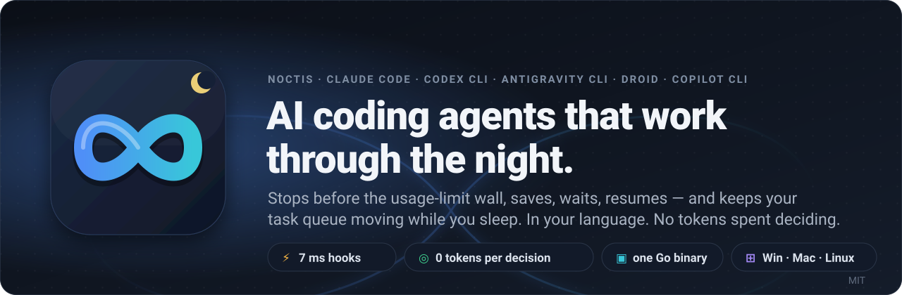
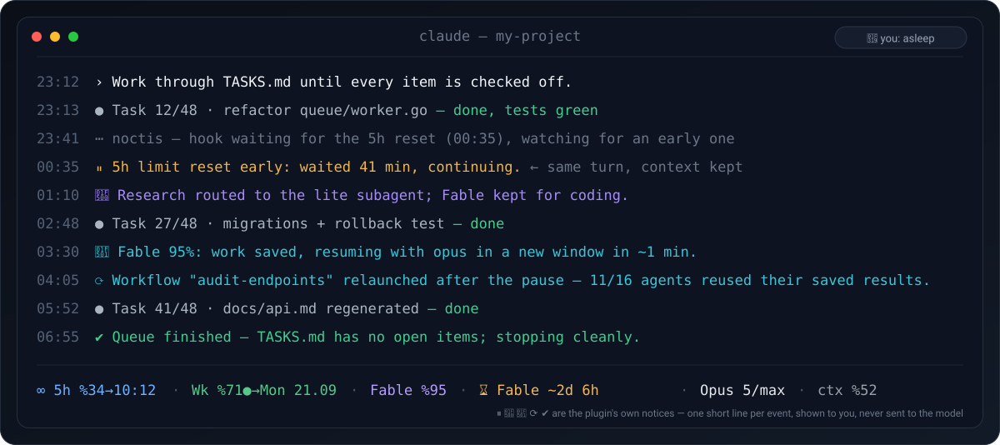
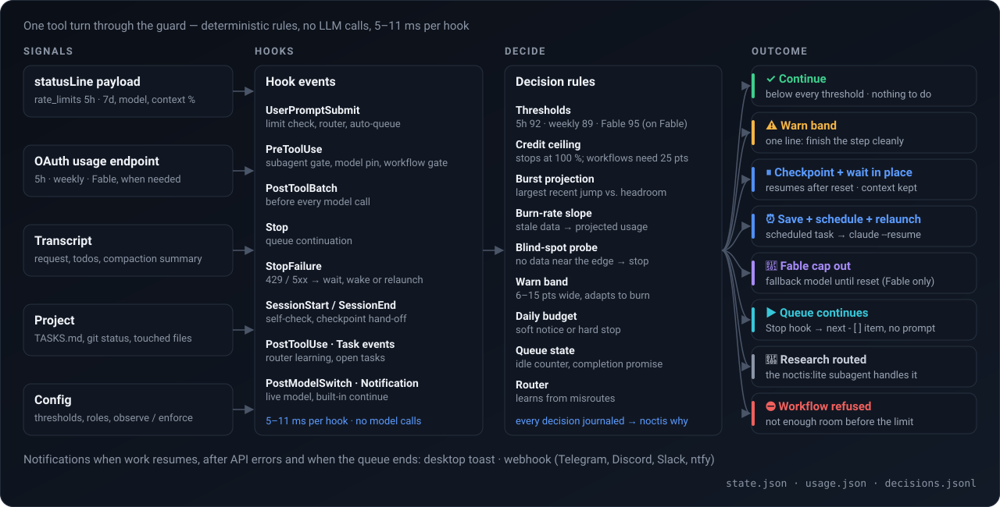
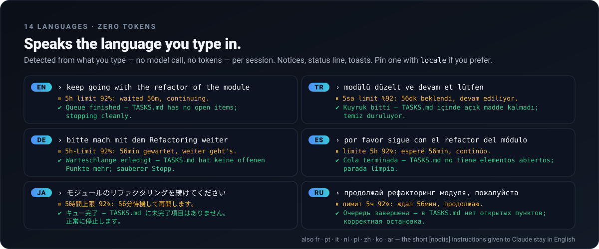
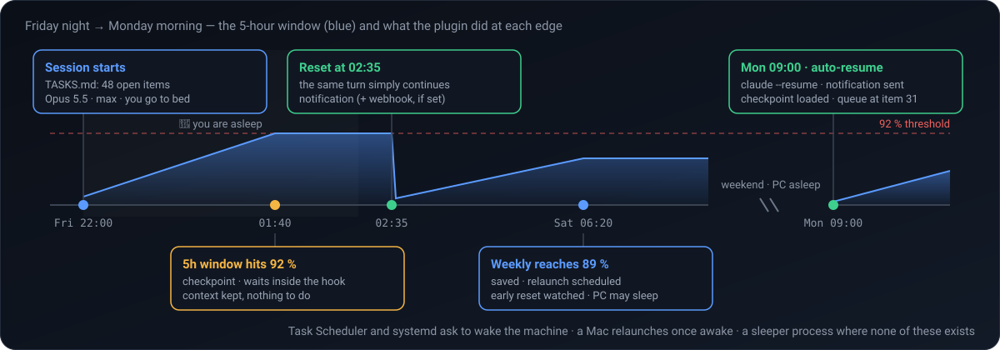
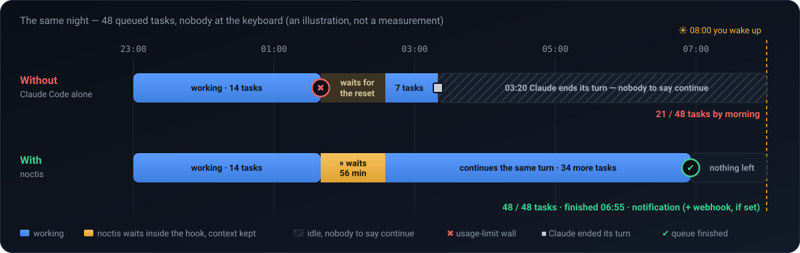
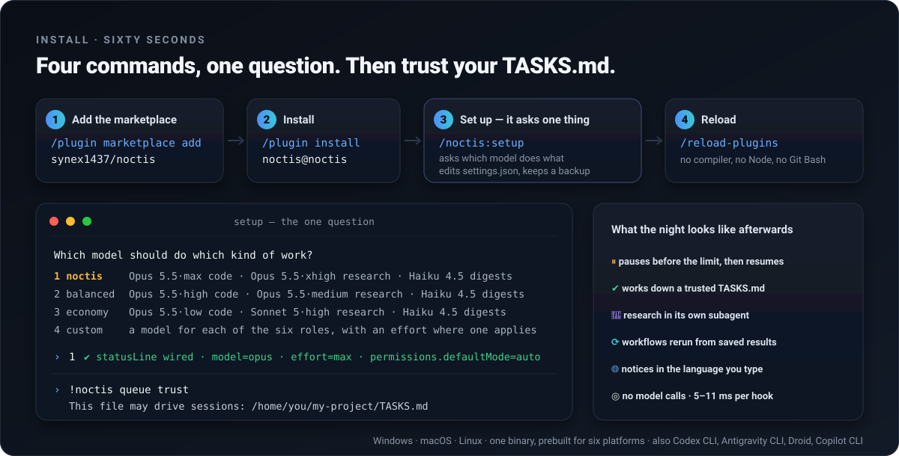
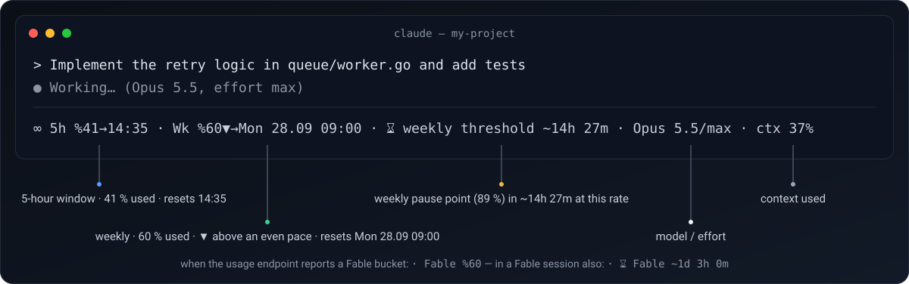

<p align="center">
  
</p>

<p align="center">
  <a href="https://github.com/synex1437/noctis/actions/workflows/ci.yml"></a>
  <a href="https://github.com/synex1437/noctis/releases"></a>
  
  
  <a href="LICENSE"></a>
  <a href="README.tr.md"></a>
</p>

# Noctis — a Claude Code plugin that pauses before usage limits and resumes after the reset

You queued forty tasks, went to bed, and woke up to *"You've hit your session limit"* at 01:40 — or to a session that stopped at task three with *"moving on to the next thing"*.

**Noctis** keeps long Claude Code jobs running unattended:

- **Pauses just before** the 5-hour or weekly limit, with a checkpoint, and **continues the same session** after the reset — inside the turn when the reset is close, otherwise by relaunching `claude --resume` from a scheduled task, even days later.
- **Works through a `TASKS.md` checklist** without stopping to ask — priorities, dependencies, GitHub issues.
- **Gives each kind of work its own model**: by default code on Opus 5.5 · max, research and writing in a subagent on Opus 5.5 · xhigh, file search and output digests on Haiku 4.5.
- **Decides without a model call**: fixed rules over your usage data, so deciding costs no tokens, and each decision is logged (`noctis why`). It stops at 100 % of a window rather than spend paid usage credits.
- Draws its own **status line**, speaks **14 languages**, and has adapters for **Codex CLI, Antigravity CLI, Factory Droid and Copilot CLI**, with fewer features there ([Other AI coding tools](#other-ai-coding-tools)).

**Install** — four lines inside Claude Code, about a minute. The third asks one question, which model does which kind of work, and switches Claude Code to **auto permission mode, so Claude edits files and runs commands without asking** — that is what lets it work overnight. `--permissions keep` opts out; every change and its undo is [listed below](#what-it-changes-on-your-machine--and-how-to-undo-it).

```
/plugin marketplace add synex1437/noctis
/plugin install noctis@noctis
/noctis:setup
/reload-plugins
```

If `/noctis:setup` is not found yet, run `/reload-plugins` first. From a terminal instead: `claude plugin marketplace add synex1437/noctis && claude plugin install noctis@noctis`, then `/noctis:setup` inside Claude Code.

**Requirements:** Claude Code 2.1.251 or newer; Windows, macOS or Linux; a Pro or Max subscription for the limit guard. On an API key there are no usage windows, so the guard has nothing to act on: the status line shows *waiting for limit data*, and a note at session start, at most once a day, says there is no OAuth token. Queue mode, the router and the 529/5xx retry still work. No Node, no Git Bash, no compiler. Every profile runs on models every paid plan includes — Opus 5.5, Sonnet 5, Haiku 4.5 — so none of them needs Max; none uses Fable, which bills usage credits on Pro.

**Claude Code already continues after a reset — why noctis?** Recent Claude Code versions can continue a session on their own once a usage limit resets, as long as that session stays open, the machine stays awake and the reset is less than 24 hours away. noctis covers the rest: it pauses *before* the limit with a checkpoint, relaunches the session from a scheduled task when Claude Code was closed or the reset is days away (the weekly limit), and keeps a `TASKS.md` queue moving. When Claude Code's own continue fires, noctis cancels its relaunch.

<p align="center"></p>

## What it changes on your machine — and how to undo it

<details>
<summary>Every settings key noctis writes, what it talks to on the network, how the binaries are checked, and the undo for each.</summary>

From the first session after install — before you run setup — noctis already points the status line at itself (a status line you had keeps running behind it; this edit makes no backup) and guards with the default thresholds. Setup then writes a backup `settings.json.bak-<time>` and touches exactly this:

| Where | What | Undo |
|---|---|---|
| `settings.json` → `statusLine` | Points it at the plugin's binary — that is how Claude Code reports your usage. A status line you already had keeps running behind it. | `noctis install --uninstall` |
| `settings.json` → `permissions.defaultMode` | Set to `auto` (older Claude Code: `acceptEdits`) by the first setup on the account. **Claude will edit files and run commands without asking you first** — that is what lets it work while you sleep. A later setup run leaves the mode as it is — changed by you, or kept with `--permissions keep` — unless you pass `--permissions`. Never `bypassPermissions`: an unattended relaunch refuses that mode even if a config asks for it. | `--permissions keep` at setup; the `--permissions` value setup names as the way back; `noctis install --uninstall` |
| `settings.json` → `model`, `env.CLAUDE_CODE_EFFORT_LEVEL` | Default model and effort = the *code* role of your profile (**Opus 5.5 · max** by default). A Fable or Opus you picked yourself is kept; a model setup wrote earlier follows the profile. A setup run while Fable's cap has the default on a Fable or Opus fallback model keeps that model too and sets only the effort; unless your code role names that model, Fable's reset then puts in the model setup would have chosen without the switch: the code role's, or a Fable or Opus you picked yourself before it. | `--no-model` at setup keeps your model (the effort is still set); `noctis install --uninstall` |
| `settings.json` → `model`, `env.CLAUDE_CODE_EFFORT_LEVEL`, while it runs | Only if you run Fable: when its weekly cap runs out, both switch to the fallback role, and back after the reset. If Claude Code reports `model_not_found`, `model` is set to the fallback model or removed. | — |
| `settings.json` → `env.CLAUDE_CODE_ENABLE_FUNCTION_HOOKS` | Set to `1` when it is missing, so Claude Code loads the [lean compaction](#lean-compaction) module. It is an early-access switch and loads the hooks module of **every** installed plugin, not only noctis's. A value you set yourself is kept. | `--no-lean` at setup (also turns lean compaction off); `noctis install --uninstall` |
| `~/.claude/noctis/` | Its own `config.json`, usage snapshots, checkpoints, logs | Delete the folder |
| A scheduled task, only while a resume is pending | Task Scheduler `Noctis-…` (can wake the PC), launchd `com.synex.noctis.…`, systemd `noctis-…` (both get the PATH, display, certificate and proxy variables of the session that paused, so the relaunch finds `claude` as that session did) — or, where none of these exists, a background `noctis sleeper` process (it cannot wake the machine and does not survive a reboot). Next to a scheduled task, a background `noctis sleeper --watch` process checks for an early reset every 5 minutes until the resume time (`wait.earlyResetPollMinutes: 0` turns it off). | `noctis cancel`; `"alarm": {"wakePc": false}` stops the wake |
| Marketplace auto-update | Turn it on once in `/plugin` → Marketplaces → noctis → Enable auto-update, so new versions arrive on their own. Setup also tries to switch it on, which current Claude Code versions refuse; if setup says it could not enable auto-update, use that menu. | The same menu → Disable auto-update |

A `settings.json` that is a symlink — into a dotfiles repository, say — stays one: setup, uninstall and the model switch write the file it points to and keep that file's permissions. The same goes for noctis's own `config.json` and another tool's hook file.

After uninstalling, check `permissions.defaultMode` and `env.CLAUDE_CODE_EFFORT_LEVEL` in `settings.json`: uninstall puts back the value you had before the first setup, however often setup ran since (a profile switch that changes the effort, say, or a setup while the fallback role stands in). A value you set yourself between two setup runs does not come back once a later run has replaced it. A value you changed after the last setup run stays, and so does one setup found already set to what it writes, or one it holds no record of. Uninstall then forgets what setup recorded, so a setup after it starts over as a first one: without `--permissions` it switches the permission mode to `auto` again, and it chains the status line you have then, which the next uninstall puts back. `env.CLAUDE_CODE_ENABLE_FUNCTION_HOOKS` is removed only when setup wrote it.

**Network.** Two servers, plus any you configure. `api.anthropic.com`, the usage endpoint the Claude app itself uses, with the login token Claude Code already keeps — on macOS that lives in the Keychain, so expect an "allow access" prompt, one per account. It is asked only when the status line is not enough: at most every 10 minutes when the status line has been quiet for 20 minutes, in a Fable session and when a subagent starts on Fable (every minute within 8 points of the Fable switch point), every 2 minutes down to every 15 seconds within 8 points of a pause point or of the 100 % stop (near the stop also while `/noctis:pause` runs), every 5 minutes while a paused session waits (`wait.earlyResetPollMinutes: 0` stops that), and once before a workflow launch, after an API error and before a relaunch. And once a day the raw `plugin.json` on GitHub, to see whether a newer version exists — fetched by a detached process, so a session start never waits for it (`update.check: false` turns that off). Plus your webhook URL, if you set one, and GitHub through your own `gh` CLI when you use `noctis queue import` or `queue.github.closeOnDone`. No telemetry.

**It does not spend paid usage credits.** Work stops at 100 % of a window, or just before it when the last readings jumped far enough or a stale reading's trend says the next turns cross it, even if your thresholds are misconfigured or switched off, and even while `/noctis:pause` is running, because past that point the account pays for the overflow. A dynamic workflow fans out many agents at once and can burn the last points between two checks, so a new one is refused unless every usage window it can draw on has 25 points of room before its pause point (with the defaults: 5-hour at most 67 %, weekly at most 64 %). The Fable bucket counts when the usage endpoint reports one and Fable could run the workflow's agents: the session runs on Fable, a role the workflow advice names is on Fable, or the launched script names Fable, passes it in its args, starts another workflow or cannot be read (a workflow launched by name, for one). The one exception is observe mode, which does not enforce this stop either. `"credits": {"allowPaid": true}` if you *want* the overflow; `ceiling` and `fanOutHeadroom` tune the rest. What noctis cannot do is switch off auto-reload on the account — that is in your Anthropic billing settings.

**Queue mode runs a checklist for you.** When the project folder holds a `TASKS.md` (or `tasks.md`, `.claude/TASKS.md`, `docs/TASKS.md`) with open items, the Stop hook hands Claude the next open item every time it stops and tells it not to stop or ask. In Claude Code the project folder is the one the session started in, so the queue keeps driving after Claude moves into a subfolder with `cd`; a subfolder's own queue file counts only when the project folder has none. A queue file that is a link leading out of the folder, or that sits in a linked folder that does, is ignored, and `noctis queue import` writes through no such link. Because a checklist can arrive with a `git clone`, noctis asks before it *instructs* a session to work through one: every session started in that folder shows

```text
☰ TASKS.md in this folder holds 12 open item(s). It is not driving this session: a checklist can
  arrive with a repository, and driving means working through it without stopping to ask.
  To let it drive: noctis queue trust (noctis)
```

and gets the queue instructions only after `noctis queue trust` (inside Claude Code: `!noctis queue trust`; `untrust` takes it back, `status` says where it stands). **Until you do, the file drives nothing: no instructions at session start, no continuation when Claude stops, no items in the checkpoint or the relaunch prompt, no issues closed.** A checklist noctis wrote from your own prompt needs no trust. Trust every file, as versions before 5.4 did: `"queue": {"requireTrust": false}`. No queue at all: `"queue": {"enabled": false}`; no `TASKS.md` queues but keep the checklists from long prompts: `"queue": {"files": []}`.

**The binaries.** The six prebuilt binaries in `bin/` are rebuilt from source by CI on every push, and the build fails unless they match the committed ones byte for byte. Release downloads carry GitHub build-provenance attestations (`gh attestation verify noctis-linux-amd64 --repo synex1437/noctis`). The Go code uses the standard library only; the binaries are not code-signed or notarized ([what that means](#install-details)).

**Turn it off.** For a while: `/noctis:pause 120` — for 120 minutes (60 by default) there are no limit pauses, no research routing and no queue continuation; the stop at 100 % still applies. `/noctis:resume` ends it early. Watch only: `"mode": "observe"` in `~/.claude/noctis/config.json` (step 5 below). Completely, inside Claude Code:

```
!noctis cancel                             # drop pending resumes and their scheduled tasks
!noctis install --uninstall --host claude  # restore settings.json — run this BEFORE the next line,
                                           # because removing the plugin deletes the binary that undoes it
/plugin uninstall noctis
```

Clone install: in a terminal, `scripts/install.sh --uninstall` (macOS, Linux) or `scripts\install.ps1 -Uninstall` (Windows) instead of the middle line (it asks which tool; `--host claude` / `-Tool claude` skips the question). If the uninstall stops with "… cannot be read", nothing was removed: fix that file, or undo the settings by hand as the next paragraph describes, before you remove the plugin.

If the plugin is already gone and the settings remain, undo it by hand: remove `permissions.defaultMode`, `model`, `env.CLAUDE_CODE_EFFORT_LEVEL`, `env.CLAUDE_CODE_ENABLE_FUNCTION_HOOKS` and the `statusLine` block from `~/.claude/settings.json` (the status line noctis took the place of, the one you had before or one you set after installing, is saved as `statusline.chainCommand` in `~/.claude/noctis/config.json`), or restore a `settings.json.bak-<time>` copy — setup takes one before each run, so the oldest is closest to your original (it may already hold noctis's status line). `permissions.defaultMode` is the one that matters: left behind, every future session keeps editing files and running commands without asking.

</details>

## The first five minutes

1. After `/reload-plugins`, look at the bottom of the window: `∞ 5h %41→14:35 · Wk %23▲→Mon 21.09 09:00 · Opus 5.5/max · ctx 37%` — both usage windows and when each resets, the model and effort, and how full the context is. If it says *waiting for limit data*, send one message; it fills in after the first reply.
2. Type `/noctis:status`: usage, pause points, which model does which job, and the last decisions the plugin made.
3. Write the three-line `TASKS.md` below, type `!noctis queue trust` in Claude Code (the `!` runs it as a shell command) to let it drive, and tell Claude "work through TASKS.md". Watch it tick items off on its own.
4. At a limit there is nothing to do. A reset within about 5½ hours is waited out inside the turn, context intact. For a later one, the work is saved and the same session is resumed with `claude --resume` in a new terminal — a Windows Terminal tab (or a console window), a macOS Terminal window, your Linux desktop terminal. On macOS and Linux it runs headless, with output in `resume-output.log`, when no terminal can be opened; on Windows a failed window launch is reported with the `claude --resume` command to run. Windows and Linux ask to wake the machine (Linux needs `CAP_WAKE_ALARM`); launchd cannot wake a Mac, so keep it from sleeping for the night.
5. Not ready to trust it? `"mode": "observe"` in `~/.claude/noctis/config.json` logs every limit, queue and routing decision and enforces none of them — not even the stop at 100 %, so turn off auto-reload in your Anthropic billing settings while you watch. Three things still happen in observe mode: the lite and digest subagents keep their write limits, a `model_not_found` error still resets `model`, and `queue.github.closeOnDone` still closes issues.

## Queue file

<details>
<summary>The `TASKS.md` format, plus priorities, tags, dependencies and GitHub issues.</summary>

One task per line, in the folder where you start `claude`:

```markdown
- [ ] add input validation to the signup form
- [ ] write tests for the payments module
- [ ] update README for the new CLI flags
```

That is the whole format. Claude takes the first open item, ticks it `- [x]` when done, and moves on without asking; once every item is ticked it stops, with `✔ Queue finished` if noctis had to push the list along (always for a checklist noctis wrote itself). Sloppy lists are accepted (`-[ ]`, `* [ ]`, `1. [ ]`, `[]`, `TODO:`), and an item wrapped over several lines is one item. Lines inside a fenced code block (```` ``` ```` or `~~~`) are examples, not items. In a checkbox list an item is done when its box is ticked (`[x]`, `[X]`, `[✓]`, `[✔]`). A plain bullet list without boxes works too: there `~~struck~~`, `(done)`, `✓` and `✔` mark an item finished, and Claude is asked to rewrite the list with checkboxes first.

Priorities and dependencies:

```markdown
- [ ] (P0) fix the login redirect #auth
- [ ] (P1) migrate users (after #auth, #db)
- [ ] deploy (after 2)
```

`(P0)`–`(P9)` orders the work (default P5, lower first) and `#name` tags an item. Tags are ASCII — a letter, then letters, digits, `_` or `-`: `#café` is read as `#caf`, and an `(after #café)` then matches nothing and is ignored. `(after #tag)` or `(after 3)` waits until the referenced items are checked; `(after 2)` means the 2nd item in the file. `(after #12)` or `(after owner/repo#12)` waits for the items of that GitHub issue, and an item's reference to itself is ignored. The Stop hook hands Claude the highest-priority eligible item, says how many are still waiting, and stops cleanly when all are blocked or done. A reference that matches nothing is ignored, so a typo never deadlocks a night.

`noctis queue import` appends open GitHub issues as `- [ ] (P1) #123 Title` through the `gh` CLI (`owner/name#123` with `--repo owner/name`) — priority from `P0`–`P9` or `priority: high` labels, idempotent — and `queue.github.closeOnDone` closes an issue once the items that start with its reference are all ticked; a `#123` further along an item closes nothing. A close that `gh` refuses (no login, no network) is tried again at the next stops, three times in all, and then left with gh's reason in `errors.log`.

</details>

## What it does while you're away

<details>
<summary>Situation by situation: limits, early resets, queue stops, quota switches and the failures it handles alone.</summary>

| Situation | What happens |
|---|---|
| Usage nears the limit (92 % / 89 %) | The turn pauses **before** the wall, after a checkpoint of the last request, touched files, `git status`, todos and next queue items. A reset within about 5½ hours is waited out in place; for a later one the work is saved and resumed by a scheduled task — Task Scheduler (can wake the PC), launchd or systemd. You get a desktop notification and, if set, a webhook when work resumes. When the pause comes from something other than the pause point — the daily budget, a burst or burn-rate projection, missing data, an imminent context compaction or the paid-credit ceiling — its notice says so: `Pause reason: burst projection.` |
| The reset comes early | The wait notices within minutes: it re-checks every 5 minutes and goes on as soon as the paused window reads at least 10 points below both its pause point and its level at the pause. `⚡ 5h limit reset ahead of schedule`. After a limit error with no usage data at all, the scheduled relaunch waits for data: it checks after 10, 10, 20, 30 and 45 minutes, then gives up with a notification; an open session is woken in place after 10 minutes instead. |
| Claude stops with "moving on to the next thing" | In queue mode the Stop hook hands it the next unchecked item, no confirmations, and stops cleanly when the queue is empty. |
| You paste a long prompt with several tasks | noctis writes the checklist itself, in its own folder, and runs it: `☰ 5-step job detected`. Claude Code would ask before Claude ticks a file there, so noctis answers that one request itself. Short prompts and single tasks are left alone; `queue.auto: false` turns this off. |
| Fable's weekly cap runs out (only if you picked Fable) | The default model and effort switch to the fallback role. Mid-task, the session is checkpointed and relaunched on it in a new window; a new prompt is held with a note to switch with `/model` and resend. Subagents pinned to Fable, or asked to run on it, use the fallback model too, and a session that waited for another limit comes back on the fallback role (model and effort) when Fable's cap is still out. At the reset the model and effort go back to what `settings.json` had before, and are removed again if it had none; a model or effort you picked in the meantime, or a setup you ran, stays. |
| A prompt is research or writing | It goes to the `noctis:lite` subagent — Opus 5.5 · xhigh by default, Sonnet 5 on `economy` — so the main session keeps its context for the code. File search (Explore) and the `noctis:digest` subagent for long test and build output run on Haiku 4.5. |
| A 429 kills the turn anyway | The session is woken **in place** at the reset if that is within about 5½ hours (`wake.maxMinutes`), with a scheduled relaunch as the net; a later reset gets the scheduled relaunch only. Claude Code's own error text is trusted over the percentages. In a `claude -p`, Agent SDK or GitHub Action run, where Claude Code ends the hook as it shuts down, the hook hands the error to a detached copy of noctis, which stores the retry and its relaunch. |
| The API is overloaded (529 / 5xx) | Growing pauses instead of dying: 30 s → 5 min, two-hour budget, one notice, one more if the outage is real. |
| Usage numbers stop arriving near the limit | It stops rather than guess: burn-rate projection, burst prediction, a blind-spot probe, 15-second refreshes inside two points of the pause point, and the same near the 100 % stop for a window whose threshold is switched off. When fresh data shows room again, the pause ends early. |
| A window is at 100 %, or about to cross it | Work stops there whatever the thresholds say, and just before it when the last readings jumped far enough or a stale reading's trend says the next turns cross it; a pause does not lift it (observe mode aside): past that point the account pays for the overflow. |
| The task is a fan-out ("migrate every endpoint") | Claude is told to run a **dynamic workflow** with your roles profile's models, whenever a launch would be allowed right then. A new launch is refused in the warn band, or unless every window it can draw on (the Fable bucket only when Fable could run its agents) has 25 points of room before its pause point; every launch is recorded, and after a pause Claude is told to relaunch the same run so finished agents return saved results. In Claude Code, agents already running meet the pause point too: they are told to report what they have, then stopped, and the checkpoint names each agent cut short so the resumed session redoes its part. |
| You install at 99 % of the weekly quota | Setup works: `/noctis:setup`, `:status`, `:pause` and `:resume` pass the pause point (not the 100 % stop), but your answer to setup's question is an ordinary prompt, so give it `--profile` or run `/noctis:pause 120` first. The first session says when work resumes, the first prompt is parked until the reset (`/noctis:pause 120` to keep going), and `noctis check` reports it to scripts. |
| You write in German, Japanese, Turkish… | With `locale: auto` (the default), notices, the status line and a session's own toasts follow the language you type, detected without a model call; before that, the system language (`LC_ALL`, `LC_MESSAGES` or `LANG`, else English). `NOCTIS_LANG` or a fixed `locale` pins one language instead. Toasts from a scheduled relaunch use `NOCTIS_LANG`, `locale` or the system language. All fourteen are complete — CI fails if one lacks a message, takes different arguments from the English, or misaligns the `noctis status` labels. The `[noctis]` instructions handed to Claude stay English everywhere. |
| Files changed while the session waited | The checkpoint fingerprints the working tree: `git status`, the commit `HEAD` points at, and the size and modification time of up to 2000 paths: the files `git status` lists first, then the files inside a folder it lists as untracked. If any of it differs at resume — a file edited again after the session had already changed it, a commit, a pull — Claude is told that files it read or edited before the pause may have changed (`wait.workspaceGuard`). `checkpoint.gitSnapshot` can pin uncommitted changes to tracked files as a hidden git ref. Neither takes `.git/index.lock`, so a `git add` or `git commit` another session or agent runs at that moment is not turned away, and a `git status` or snapshot that noctis cuts off at its time limit leaves no `.git/index.lock` behind; a cut-off snapshot leaves no temporary index either. |
| Two things try to resume one session | Only one relaunch happens; the session is claimed under a lock. |
| A long wait ends | The session returns where you can see it — a Windows Terminal tab (or a console window), a macOS Terminal window, your Linux desktop terminal. On macOS and Linux it runs headless with output in `resume-output.log` if none can be opened; on Windows a failed window launch is reported with the `claude --resume` command to run. A window noctis itself opened for that session earlier is closed first, unless it was used in the last five minutes; the window you started in stays open, shows `↪ continues in another window` and refuses new prompts while the relaunched session runs. A relaunch that ends without the session answering — it exits with an error before any reply, or its window closes within 30 seconds without touching the session — keeps the wait and is tried again on the `wait.retryMinutes` steps; the fifth such relaunch gives up with a notification naming the project folder and the `claude --resume` command to run there. A relaunch that cannot start at all — the tool's command is not on `PATH`, or the project folder is gone — sends that one notification with the reason instead of first announcing the resume. |
| A terminal is closed, a process killed, a file half-written | The engine repairs itself: corrupt `state.json`/`usage.json` restored from backup, a dead hand-off unblocked, a wait whose runner is gone (a reboot, a logout, a killed sleeper) re-armed at the next prompt, status-line refresh or session start, stray temp files and locks swept. |
| A threshold is edited into nonsense | The shipped default guards that window instead, and `noctis status`, `noctis doctor` and the next session all name the threshold. Set it to `0`, `null` or `false` to leave a window unguarded on purpose; it still stops at 100 %. |
| A new version is published | With marketplace auto-update on, Claude Code downloads it and the next session says `⬆ noctis <new> was downloaded (this session still runs <current>): run /reload-plugins` once. Otherwise a one-line notice names the version and the command. |

<p align="center"></p>

</details>

## Lean compaction

When Claude Code compacts a conversation — `/compact`, its own automatic compaction, or the early one below — noctis can trim what the summary is written from, so the summary request reads less. It trims only while Claude Code's prompt caching is off (`DISABLE_PROMPT_CACHING`): with caching on, the summary request reads the conversation from the prompt cache at a tenth of the input price or less (a twentieth on Opus 5.5), and a trimmed row would make everything after it cost the full input price or more, so noctis hands the conversation down as it is. It makes no model call of its own; the summary is still Claude Code's.

- **Trimmed, only in the older part of the conversation:** a tool result or tool input longer than 2 000 characters keeps its first and last 1 000 around a `[noctis: N chars trimmed]` marker; a `Read`, `Grep`, `Glob`, `LS`, `WebFetch` or `WebSearch` result is dropped when the same call, with the same arguments, ran again later; `<system-reminder>` blocks leave older user messages.
- **Never touched:** your prompts, Claude's replies, which tools ran with which arguments (apart from long strings in them), and the last 6 assistant messages with everything after them (`compaction.keepTurns`).
- **Not next to a usage limit:** the early compaction below is not asked while a 5-hour or weekly window is within 6 points of its pause point, since the summary request could carry it past that point — the margin the guard keeps before Claude Code's own compaction (`compaction.contextPercent`); a later turn asks again.
- **Early, between turns:** when a turn ends with the context 70 % full (`compaction.compactAtPercent`), noctis asks Claude Code to compact right then instead of at its own, later threshold — once per crossing: it asks again only after a turn has ended below the mark. This works in an interactive session only; Claude Code 2.1.281 refuses it in `claude -p` and SDK sessions, where the trimming still applies to `/compact` and to Claude Code's automatic compaction. It stays off while Claude Code's own automatic compaction is off (`autoCompactEnabled: false`, `DISABLE_AUTO_COMPACT`, `DISABLE_COMPACT`).
- **Needs Claude Code's early-access function hooks:** `"env": {"CLAUDE_CODE_ENABLE_FUNCTION_HOOKS": "1"}` in `~/.claude/settings.json` (tested with Claude Code 2.1.281), which setup writes when it is missing and uninstall takes back. That switch loads the hooks module of every installed plugin, not only noctis's. `/noctis:setup --no-lean` leaves it alone and turns lean compaction off (`compaction.lean: false`, which later setups keep). Without the switch noctis works as before, and compaction is Claude Code's alone.

Each compaction noctis trimmed adds a line to `~/.claude/noctis/compact.log`; `noctis status` counts them and `noctis why` lists them among its decisions. To turn it off: `"compaction": {"lean": false}` in `~/.claude/noctis/config.json`; the other keys are in [docs/REFERENCE.md](docs/REFERENCE.md). A key of the wrong type or out of range falls back to its shipped value, and `noctis status` and `noctis doctor` name it.

## Works alongside other plugins

In Claude Code, noctis adds hooks and a status line and never removes or rewrites anyone else's (on Antigravity CLI it replaces a custom status line). Claude Code runs every hook for an event, so a loop plugin and noctis's queue can both push the same turn — harmless, but if you see double continues, pause one. A status line you already had (ccstatusline, claude-powerline) keeps running behind noctis's, and usage dashboards (ccusage, Claude-Code-Usage-Monitor) read the same files and are unaffected. Another tool that resumes sessions after a limit (unsnooze, claude-auto-resume) would race noctis — use one of them. `noctis doctor` lists the neighbours it can see.

## In your language

<p align="center"></p>

## Other AI coding tools

The same engine also runs inside **OpenAI Codex CLI**, **Antigravity CLI** (Google), **Factory Droid** and **GitHub Copilot CLI**, with fewer features: Codex and Antigravity pause before the limit, checkpoint, wait and relaunch (Antigravity also retries after a quota error); Copilot gets queue mode plus a checkpoint and retry after a rate-limit error; Droid gets queue mode only. None of them gets model fallback, research routing or same-session wake. From a clone or the GitHub ZIP (Code → Download ZIP), `./scripts/install.sh` (macOS, Linux) or `.\scripts\install.ps1` (Windows) asks which tool — or pass `--host codex` / `-Tool codex` — then wires that tool's hook file and resumes with its own command. These adapters are tested against stand-ins of the tools, and the Claude Code, Codex and Copilot command-line flags are checked against the real CLIs every week; none has run a full real session yet. Details: [docs/REFERENCE.md](docs/REFERENCE.md#other-ai-coding-tools) and [docs/HOSTS.md](docs/HOSTS.md).

## Friday night → Monday morning

<details>
<summary>A weekend that needs nobody: checkpoint, wait out the reset, relaunch on Monday.</summary>

<p align="center"></p>

Nothing in that weekend needs you. The checkpoint holds the last request, touched files, `git status`, todos and the next queue items. A short reset is waited out inside the hook, so the turn simply continues; a long one is relaunched at the reset time — Windows, and Linux with `CAP_WAKE_ALARM`, can wake the machine for it, and a Mac relaunches once it is awake.

<p align="center"></p>

</details>

## How it compares

| Capability | noctis | usage dashboards / status lines | loop plugins ("keep going") | auto-resume scripts |
|---|:---:|:---:|:---:|:---:|
| Stops **before** the wall (thresholds + burst + burn-rate projection) | ✅ | show only | — | react after the 429 |
| Resumes on its own after the reset (same session, or a scheduled relaunch even days later) | ✅ | — | — | partly |
| Stops at 100 % instead of spending paid usage credits, and gates fan-out by measured headroom | ✅ | — | — | — |
| Keeps a task queue moving across stops, no confirmations — priorities, dependencies, GitHub issues | ✅ | — | ✅ (flat) | — |
| A separate research subagent (Opus 5.5 · xhigh by default); Haiku 4.5 for file search and output digests | ✅ | — | — | — |
| If you run Fable: falls back to your fallback model (the code model in every shipped profile) when its weekly cap runs out, and back after the reset | ✅ | — | — | — |
| Deterministic, zero tokens per decision, journaled (`noctis why`) | ✅ | ✅ | prompt-driven | varies |
| Overload (529/5xx) backoff with jitter, separate from limit handling | ✅ | — | — | some |
| ccusage-compatible cost report (`noctis report --json`), exit-code gate for crons/CI | ✅ | ✅ / — | — | — |
| No runtime to install (one self-contained binary; on Linux ~5 ms per hook, ~11 ms through the sh launcher of a macOS or Linux marketplace install) | ✅ | varies | varies | varies |
| Observe mode to watch the limit decisions before they are enforced | ✅ | — | — | — |
| Dynamic workflows: suggested for fan-out, gated near the limit, rescued after a pause | ✅ | — | — | — |
| Roles profile: which model does code, research, planning, digests, search, fallback | ✅ | — | — | — |
| Follows the language you type in (14 languages, all complete) | ✅ | some | — | — |
| Works inside Claude Code — and, with fewer features, Codex CLI, Antigravity CLI, Droid and Copilot CLI | ✅ | some | Claude only | some |

## Install (details)

<details>
<summary>Marketplace and clone installs, the roles profile, the flags, and what to do if the binary will not run.</summary>

<p align="center"></p>

**From a marketplace** — the four lines at the top. `setup` asks one thing, **which model should do which kind of work**, and remembers it as your *roles profile*:

| Profile | code | research & writing | planning | digests & search | fallback |
|---|---|---|---|---|---|
| `noctis` | Opus 5.5 · max | Opus 5.5 · xhigh | Opus 5.5 | Haiku 4.5 | Opus 5.5 · max |
| `balanced` | Opus 5.5 · high | Opus 5.5 · medium | Opus 5.5 | Haiku 4.5 | Opus 5.5 · high |
| `economy` | Opus 5.5 · low | Sonnet 5 · high | Opus 5.5 | Haiku 4.5 | Opus 5.5 · low |
| `custom` | a model per role, with an effort where one applies | | | | |

Run `/noctis:setup` again to change it, or skip the question with `--profile noctis|balanced|economy` or `--code opus:high --research sonnet:high …`; `/noctis:status` shows the current assignment. Why these: on the three coding benchmarks Anthropic published with Opus 5.5, at max it beats Fable 5.1 at max and costs less per task (Terminal-Bench 4.0 64.8 vs 55.8, FrontierCode 54.4 vs 50.3, CursorBench 57.8 vs 51.8); at xhigh it out-researches Fable 5.1 and Opus 5 at max (WANDR 71.3 vs 68.7 and 67.2); at low it is the cheapest per solved coding task of every model charted. Research at low effort collapses (WANDR 31.2), so `economy` researches on Sonnet 5. Fallback is the code model. noctis watches one per-model weekly cap, Fable's: if you move up to Fable yourself, it switches you to the fallback model when that cap runs out and returns you to Fable once it resets.

Effort reaches the main session, the research subagent and — if you give the digest role a model with effort levels — the digest subagent. `Plan` and `Explore` take a model only, because the Agent tool has no effort to give them, and Haiku 4.5 has no effort levels at all; setup says so instead of pretending otherwise.

Setup makes five edits to `settings.json` — status line, permission mode, default model, effort level and the function hooks switch lean compaction needs — listed with their undo in [What it changes on your machine](#what-it-changes-on-your-machine--and-how-to-undo-it). Flags: `--permissions keep`, `--no-model` (keeps your model; the effort level is still set), `--no-lean` (no function hooks switch, lean compaction off), `--config-dir <dir>` for another account (repeat it for several), `--preset conservative|balanced|aggressive` (pause at 85/82/90, 92/89/95 or 96/94/98 %). Every flag: [docs/REFERENCE.md](docs/REFERENCE.md#commands).

**From a clone or the GitHub ZIP** (Code → Download ZIP), a per-account copy lands under `~/.claude/skills/`: run `.\scripts\install.ps1` in PowerShell on Windows or `./scripts/install.sh` on macOS and Linux — both first ask which AI coding tool this is for — then `/reload-plugins`. That copy is 17 files (18 on Windows) and 7–8 MB, almost all of it your platform's binary. Nothing is downloaded or compiled; the binary is already in the repo (`bin/<os>-<arch>/`), and one that does not match `bin/SHA256SUMS` is refused rather than installed. In this copy the hooks call the binary directly, never through a shell, and Git Bash is not needed on Windows (run from Git Bash, `install.sh` stops and points to `install.ps1`).

**If nothing happens at all** — no status line, no notices, and `noctis doctor` will not run either — the binary is not being allowed to execute. The binaries are not code-signed or notarized, so:

- **macOS**: a browser download gets a quarantine flag and is killed on sight. `xattr -dr com.apple.quarantine <plugin folder>`, or install with `git clone`, which never sets the flag.
- **Windows**: SmartScreen may block a downloaded `.exe` — Properties → Unblock, or clone instead.
- **From a zip**: zips do not always carry the executable bit. `chmod +x bin/noctis bin/*/noctis`.
- **Anything else**: run `bin/<os>-<arch>/noctis version` in a terminal — the error it prints is the real one. Outside Claude Code, use the full path setup prints, or add that folder to your PATH. To build from source, follow [CONTRIBUTING.md](CONTRIBUTING.md).

In the VS Code and Cursor extensions everything works, except that a relaunch after a long wait happens outside the editor — in a terminal tab or window, or, on macOS and Linux, headless when none can be opened — never in an editor tab.

</details>

## Commands

Inside Claude Code: `/noctis:setup` (run again to change models) · `/noctis:status` (usage, pause points, roles, pending waits, last decisions) · `/noctis:pause [minutes]` (default 60, or a duration such as `2 hours`, at most a week: no limit pauses, routing or queue continuation for that long; the stop at 100 % still applies) · `/noctis:resume` (back on now). `/noctis:setup` and `/noctis:pause` run only when you type them: Claude cannot start them on its own.

The `noctis` command itself: inside Claude Code, run it with a leading `!` — `!noctis status`, `!noctis why`, `!noctis queue trust`, `!noctis off 30`, `!noctis on` — because the plugin's `bin/` folder is on the PATH of Claude Code's shell. In a terminal, use the full path setup prints, or add that folder to your PATH. Every command and flag: [docs/REFERENCE.md](docs/REFERENCE.md#commands).

## Status line

<p align="center"></p>

```
∞ 5h %41→14:35 · Wk %60▼→Mon 28.09 09:00 · ⌛ weekly threshold ~14h 27m · Opus 5.5/max · ctx 37%
```

`%41→14:35` is the share of the window used and when it resets; a reset on another day also shows the day and date. `▲ / ● / ▼` shows whether weekly use is below, on or above an even pace toward the weekly pause point — `▼` means that at this rate you reach it before the reset. `⌛` says when a pause point will be reached at the current rate, if that comes before the reset. When the usage endpoint reports a Fable bucket, the line shows it (`· Fable %60`), and a Fable session gets its own ETA (`· ⌛ Fable ~1d 3h 0m`). A `⚠` in front of a window means it is within 6 points of its pause point, `⏸ 02:36` shows a pending resume time, `↪ continues in another window` marks a window whose session was relaunched elsewhere, `⚠ hooks inactive` means the status line updates but no hook has run for 30 minutes, and `👁` means observe mode. None of it spends a token. `statusline.mode: silent` keeps the data capture but prints nothing, or only your chained status line.

## Reference and limits

Every command and flag, the full configuration table, the host adapters and the file layout are in [docs/REFERENCE.md](docs/REFERENCE.md). What each test suite asks, what CI runs and what the latest run measured: [docs/TESTING.md](docs/TESTING.md). Design notes and the bug log (Turkish): [docs/PLAN.md](docs/PLAN.md). Release history: [GitHub Releases](https://github.com/synex1437/noctis/releases).

Three limits worth knowing. Usage data comes from Claude Code's status-line payload (`rate_limits`, Claude Code ≥ 2.1.251) and from the undocumented OAuth usage endpoint, which supplies Fable's bucket and backs up the 5-hour and weekly windows when the status line goes quiet — so watch `errors.log` after Claude Code updates. Same-session wake relies on `asyncRewake`, documented as observational, with the scheduled relaunch as the fallback. And lean compaction runs on Claude Code's early-access function hooks, which may change between releases; without them, compaction is Claude Code's alone.

## Contributing

Bug reports with `noctis doctor` output and the relevant `errors.log` / `noctis why --last 20` lines are the most useful thing you can send; `noctis report --bundle` zips all of that (tokens and webhook URLs are redacted, file paths and prompt text are not, so read it before you attach it). Build and test loop: [CONTRIBUTING.md](CONTRIBUTING.md).

## License

MIT — © 2026 synex
