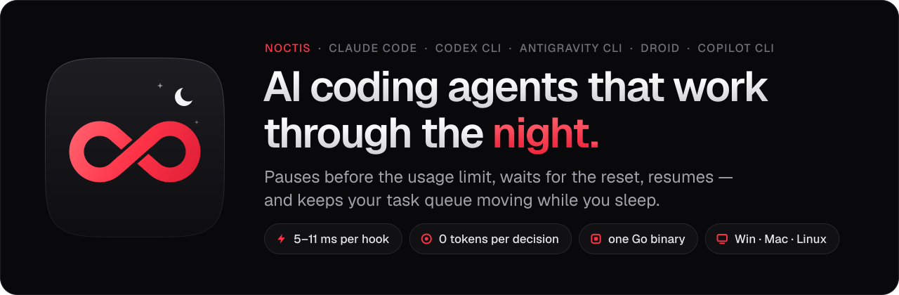
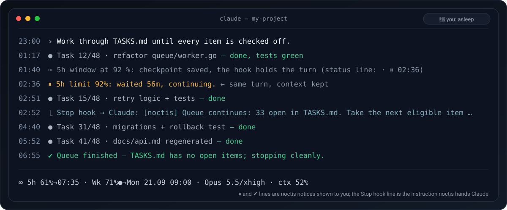
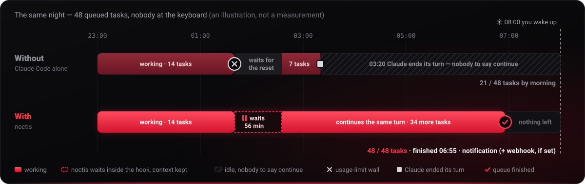

<p align="center">
  
</p>

<p align="center">
  <a href="https://github.com/synex1437/noctis/actions/workflows/ci.yml"></a>
  <a href="https://github.com/synex1437/noctis/releases"></a>
  
  
  <a href="LICENSE"></a>
</p>

<p align="center">
  <a href="#kurulum"><b>Kurulum</b></a>&nbsp;&nbsp;·&nbsp;&nbsp;<a href="#hızlı-başlangıç"><b>Hızlı başlangıç</b></a>&nbsp;&nbsp;·&nbsp;&nbsp;<a href="#benzer-araçlarla-karşılaştırma"><b>Karşılaştırma</b></a>&nbsp;&nbsp;·&nbsp;&nbsp;<a href="#komutlar"><b>Komutlar</b></a>&nbsp;&nbsp;·&nbsp;&nbsp;<a href="#sss"><b>SSS</b></a>&nbsp;&nbsp;·&nbsp;&nbsp;<a href="docs/GUIDE.tr.md"><b>Kılavuz</b></a>&nbsp;&nbsp;·&nbsp;&nbsp;<a href="README.md"><b>English</b></a>
</p>

# Noctis — kullanım limitinden önce duraklayan, sıfırlanınca kendiliğinden devam eden Claude Code eklentisi

**Noctis uzun Claude Code işlerini gece boyunca yürütür. 5 saatlik ya da haftalık kullanım limitinden hemen önce duraklar, sıfırlanmayı bekler ve aynı oturumu kendiliğinden sürdürür; bu sırada iş kuyruğunuzu durup sormadan bitirir.**

Kuyruğa kırk iş koyup yattınız; sabah sizi 01:40'ta düşmüş bir *"You've hit your session limit"* mesajı karşıladı — ya da üçüncü işte *"şimdi diğer işe geçiyorum"* deyip durmuş bir oturum. Noctis ikisini de çözer: Claude Code'u hız limitine çarptıktan sonra değil, çarpmadan önce durdurur, limit sıfırlanınca geri döner ve listenizde ilerlemeye devam eder. Bu arada Claude'u keskin tutar: konuşma uzayınca taze bir bağlam, maddeler arasında sizin denetiminiz, takıldığı madde için daha güçlü bir model.

<p align="center"></p>

<table align="center">
  <tr>
    <td align="center" width="25%"><b>~5 ms</b><br><sub>Linux'ta hook başına</sub></td>
    <td align="center" width="25%"><b>0 token</b><br><sub>karar başına</sub></td>
    <td align="center" width="25%"><b>1 binary</b><br><sub>Node yok, Git Bash yok</sub></td>
    <td align="center" width="25%"><b>15 dil</b><br><sub>hangisini yazıyorsanız</sub></td>
  </tr>
</table>

## Ne yapar

- **Limitten önce duraklar, 429'dan sonra değil.** Varsayılan olarak 5 saatlik pencerenin %92'sinde, haftalığın %95'inde; ani bir yükseliş ya da yakım hızı sonraki turların limiti aşacağını söylüyorsa daha erken. Duraklamadan önce son isteğin, dokunulan dosyaların, `git status`'un, yapılacakların ve sıradaki işlerin checkpoint'ini alır.
- **Aynı oturumu kendiliğinden sürdürür.** Yaklaşık 5½ saat içindeki bir sıfırlanma tur içinde beklenir, bağlam korunur. Haftalık limit gibi daha geç bir sıfırlanmada oturum Task Scheduler, launchd ya da systemd'den `claude --resume` ile yeniden başlatılır; günler sonra da, Claude Code kapatılmış olsa da. Windows ve `CAP_WAKE_ALARM` ile Linux bunun için makineyi uyandırabilir.
- **Bir iş kuyruğunu bitirir.** `/noctis:start deneme.md` bir dosyadaki işleri durup sormadan sırayla yürütür; birkaç iş içeren uzun bir istem kendiliğinden böyle bir listeye dönüşür; izin verdiğiniz bir `TASKS.md` her oturumu sürükler — öncelikler, bağımlılıklar, GitHub issue'ları. `(insan)` işaretli adımlar sizi bekler, bir `noctis-verify` satırı maddeler arasında denetimlerinizi çalıştırır, uzun derlemeler de kuyruğun beklediği arka plan işleri olarak çalışır.
- **Claude'u akıllı bölgesinde tutar.** Oturumun bağlamı 100 bin token'ı geçince sıradaki her madde kendi brifiyle taze bir `noctis:worker` alt-ajanına gider; bir sıkıştırmadan sonra Claude'a eldeki madde, değişen dosyalar ve denetimin durumu söylenir; başarısız bir denetim testlerinde değil kodda düzeltilir; Claude'un takılıp kaldığı madde bir kez daha güçlü bir modele gider; `noctis queue status` her maddenin neye mal olduğunu gösterir, sonrakileri ona göre boyutlandırırsınız.
- **Ücretli kullanım kredisi harcamaz.** Eşikler kapalı olsa bile bir pencerenin %100'ünde durur ve kalan paya sığmayacak çok parçalı bir workflow'u reddeder.
- **Karar başına sıfır token.** Kullanım verileriniz üzerinde sabit kurallar işler ve her karar kaydedilir (`noctis why`). Kendi başına çalışan tek bir Go binary'si, Linux'ta hook başına yaklaşık 5 ms; Node, Git Bash, derleyici gerekmez.
- **Her işe uygun model.** Varsayılan olarak kod Opus 5.5 · xhigh'ta (Code profili), daha az harcamak için Sonnet 5.5 · high'da (Balanced), dosya arama ve çıktı özetleri Haiku 4.5'te; yönlendirici açıkken araştırma ve yazı kendi alt-ajanında.
- **Yalın sıkıştırma, durum çubuğu ve 15 dil.** Bağlam %70'e varınca turlar arasında sıkıştırır, iki kullanım penceresini ve sıfırlanma zamanlarını gösteren bir durum çubuğu çizer ve yazdığınız dilde konuşur.
- **Ayrıca** OpenAI Codex CLI, Antigravity CLI, Factory Droid ve GitHub Copilot CLI içinde de, daha az özellikle çalışır.

## Kurulum

Claude Code içinde, yaklaşık bir dakika:

```
/plugin marketplace add synex1437/noctis
/plugin install noctis@noctis
/noctis:setup
/reload-plugins
```

> [!IMPORTANT]
> Setup, Claude Code'u **auto izin moduna geçirir: Claude size sormadan dosya düzenler ve komut çalıştırır**. Siz uyurken çalışabilmesini sağlayan budur; `/noctis:setup --permissions keep` modunuzu olduğu gibi bırakır. Setup ayrıca varsayılan modeli ve effort'u, yalın sıkıştırmanın gerektirdiği fonksiyon hook'ları anahtarını ayarlar; durum çubuğu da ilk oturumdan itibaren noctis'i gösterir. Setup önce `settings.json`'ın yedeğini alır ve her değişikliğin bir geri alma yolu vardır: [neyi değiştirir, nasıl geri alınır](docs/GUIDE.tr.md#makinenizde-neyi-değiştirir--nasıl-geri-alınır).

Setup tek bir soru sorar — hangi model hangi işi yapsın — ve cevabı rol profiliniz olarak saklar. `/noctis:setup` henüz bulunamıyorsa önce `/reload-plugins` çalıştırın. Terminalden: `claude plugin marketplace add synex1437/noctis && claude plugin install noctis@noctis`, ardından Claude Code içinde `/noctis:setup`. Klon ve ZIP kurulumu, profiller ve tüm bayraklar: [kurulum ayrıntıları](docs/GUIDE.tr.md#kurulum-ayrıntı).

**Gereksinimler:** Claude Code 2.1.251 veya üstü (yalın sıkıştırma 2.1.281 ile denendi); Windows, macOS ya da Linux; limit koruması için Pro ya da Max aboneliği. Her profil tüm ücretli planlarda bulunan modellerle çalışır: Opus 5.5 ve Haiku 4.5, Code ile Balanced'da ayrıca Claude Code 2.1.284 veya üstünü isteyen Sonnet 5.5.

## Hızlı başlangıç

1. Pencerenin altına bakın: `∞ 5sa %41→14:35 · Hf %23▲→Pzt 21.09 09:00 · Opus 5.5/xhigh · ctx %37` iki kullanım penceresini ve her birinin sıfırlanma zamanını, model ve effort'u, bağlamın ne kadar dolu olduğunu gösterir.
2. Birkaç işi bir dosyaya, her satıra bir tane yazın (`- [ ] ödeme modülü için testleri yaz`) ve `/noctis:start TASKS.md` yazın. Claude onları sırayla yapar; `/noctis:stop` erken bitirir.
3. Yatın. Limitte yapmanız gereken bir şey yok: noctis duraklar, bekler ve devam eder; iş sürdüğünde bir masaüstü bildirimi haber verir.

Ona iş yaptırmaya hazır değil misiniz? `~/.claude/noctis/config.json` içinde `"mode": "observe"` her kararı kaydeder, hiçbirini uygulamaz — %100'deki durdurmayı bile. Devamı: [başlarken: ilk beş dakika](docs/GUIDE.tr.md#başlarken-ilk-beş-dakika).

## Claude Code zaten devam etmiyor mu?

Son Claude Code sürümleri, kullanım limiti sıfırlanınca bir oturumu kendiliğinden sürdürebilir; yeter ki o oturum açık kalsın, makine uyanık kalsın ve sıfırlanma 24 saatten yakın olsun. Gerisini noctis üstlenir: limitten *önce* checkpoint alarak duraklar, Claude Code kapatılmışsa ya da sıfırlanma günler sonraysa (haftalık limit) oturumu zamanlanmış bir görevden yeniden başlatır ve bir iş kuyruğunu yürütmeye devam eder. Claude Code'un kendi devamı tetiklenirse noctis kendi yeniden başlatmasını iptal eder.

<p align="center"></p>

## Benzer araçlarla karşılaştırma

| | noctis | kullanım panoları / durum çubukları | döngü eklentileri ("devam et") | otomatik devam betikleri |
|---|:---:|:---:|:---:|:---:|
| Limitten **önce** durur (eşik, ani yükseliş ve yakım hızı öngörüsü) | ✅ | yalnız gösterir | — | 429'dan sonra tepki verir |
| Sıfırlanmadan sonra kendiliğinden devam eder (aynı oturum ya da günler sonra yeniden başlatma) | ✅ | — | — | kısmen |
| Ücretli kullanım kredisi harcamak yerine %100'de durur | ✅ | — | — | — |
| Kuyruğu duruşlar boyunca yürütür: öncelik, bağımlılık, GitHub issue | ✅ | — | ✅ (düz) | — |
| Deterministik, karar başına sıfır token, günlüklü (`noctis why`) | ✅ | ✅ | istem güdümlü | değişir |
| Aşırı yük (529/5xx) için limitten ayrı geri çekilme | ✅ | — | — | bazıları |
| Kendi başına çalışan tek binary, kurulacak çalışma ortamı yok | ✅ | değişir | değişir | değişir |
| Claude Code; daha az özellikle Codex CLI, Antigravity CLI, Droid ve Copilot CLI | ✅ | bazıları | yalnız Claude | bazıları |

ccstatusline ve claude-powerline gibi durum çubukları noctis'inkinin arkasında çalışmaya devam eder; ccusage ve Claude-Code-Usage-Monitor gibi kullanım panoları etkilenmez. Limitten sonra oturumu kendisi sürdüren başka bir araç (unsnooze, claude-auto-resume) noctis'le yarışır; yalnızca birini kullanın. [Diğer eklentilerle yan yana](docs/GUIDE.tr.md#diğer-eklentilerle-yan-yana).

## Komutlar

| Komut | Ne yapar |
|---|---|
| `/noctis:setup` | İlk kurulum; hangi modelin ne yapacağını değiştirmek için yeniden çalıştırın |
| `/noctis:status` | Kullanım, duraklama noktaları, roller, bekleyen devamlar ve son kararlar |
| `/noctis:start <dosya>` | Bir dosyadaki işleri durmadan yürütür ve kaç iş bulduğunu söyler |
| `/noctis:stop` | Bu oturumun kuyruğunu bitirir |
| `/noctis:pause [dakika]` | Bir süre limit duraklaması, yönlendirme ya da kuyruk devamı olmaz (varsayılan 60 dakika); %100'deki durdurma yine geçerlidir |
| `/noctis:resume` | Duraklatmayı erken bitirir |
| `!noctis why` | noctis'in verdiği kararlar ve nedenleri; `--stats` son haftanınkileri özetler |
| `!noctis doctor` | Kurulumu denetler ve görebildiği komşuları listeler |

`/noctis:setup`, `/noctis:pause`, `/noctis:start` ve `/noctis:stop` yalnızca siz yazınca çalışır. `noctis` komutunun kendisi Claude Code içinde başına `!` koyarak çalışır (`!noctis status`, `!noctis queue trust`, `!noctis off 30`), çünkü eklentinin `bin/` klasörü Claude Code'un kabuğunun PATH'indedir; terminalde setup'ın yazdığı tam yolu kullanın. Her komut ve bayrak: [REFERENCE.md](docs/REFERENCE.md#commands) (İngilizce).

## SSS

<details>
<summary><b>Ekstra kullanım kredimi harcar mı?</b></summary>

Hayır. Eşikleriniz yanlış ayarlanmış ya da kapatılmış olsa da, `/noctis:pause` açıkken bile iş bir pencerenin %100'ünde durur; son okumalar yeterince sıçradıysa hemen öncesinde durur. Taşan kullanımı istiyorsanız `"credits": {"allowPaid": true}` yazın. noctis hesabınızdaki otomatik kredi yüklemesini kapatamaz; o ayar Anthropic faturalandırma ayarlarınızdadır.
</details>

<details>
<summary><b>Ağ üzerinden ne gönderir?</b></summary>

Telemetri yok. Durum çubuğu yetmediğinde `api.anthropic.com` üzerinde Claude uygulamasının kendi kullandığı kullanım uç noktasına, Claude Code'un zaten sakladığı giriş token'ıyla sorar. Günde bir kez, daha yeni bir sürüm olup olmadığını görmek için GitHub'dan `plugin.json`'ı alır (`update.check: false` bunu kapatır). Bunların dışında yalnızca ayarladığınız webhook'a ve issue içe aktarırken kendi `gh` CLI'ınız üzerinden GitHub'a gider. [Ayrıntılar](docs/GUIDE.tr.md#makinenizde-neyi-değiştirir--nasıl-geri-alınır).
</details>

<details>
<summary><b>API anahtarıyla çalışır mı?</b></summary>

API anahtarında kullanım pencereleri olmaz; bu yüzden limit korumasının izleyeceği bir şey yoktur ve durum çubuğunda *limit verisi bekleniyor* yazar. Kuyruk, yönlendirici ve 529/5xx sonrası yeniden deneme yine çalışır.
</details>

<details>
<summary><b>Klonlanan bir deponun TASKS.md'si Claude'a iş yaptırabilir mi?</b></summary>

Siz izin verene kadar hayır. Bir `TASKS.md`, siz `!noctis queue trust` yazana kadar hiçbir şeyi sürüklemez; sonradan eklenen ya da değişen bir satır, siz yeniden izin verene kadar onu yine durdurur. Claude `noctis queue trust`'ı kendisi çalıştırırsa hook bu çağrıyı reddeder. Dosyanın bir `noctis-verify` satırında adını verdiği denetim komutu da yalnızca verdiğiniz güven o satırı kapsadığı sürece çalışır. [Kuyruk dosyası](docs/GUIDE.tr.md#kuyruk-dosyası).
</details>

<details>
<summary><b>Büyük bir projeyi sunucuda günlerce yürütebilir mi?</b></summary>

Kuyruk bunun için var. Sunucuda `claude`'u tmux içinde çalıştırın, planı öncelikleri, bağımlılıkları ve bir `noctis-verify` denetim satırı olan bir `TASKS.md` olarak yazın, yalnızca sizin yapabileceğiniz adımları `(insan)` ile işaretleyin, zor ya da kolay bir adıma `(opus)` veya `(sonnet)` ile modelini verin ve dosyayı okuduktan sonra ona bir kez güvenin. Claude onu yürütür ve yol boyunca commit atar, uzun derlemeleri `noctis job` işleri olarak çalıştırır, takıldığı bir maddeyi kenara almadan önce daha güçlü bir modele bir kez verir, oturum dışındaki bir şeyi bekleyeni kenara alır ve başka iş kalmayınca sizde olanların listesiyle durur; uzun bir beklemeden sonraki yeniden başlatma tmux'ta yeni bir pencere olarak açılır, `noctis queue status --json` bir izleme betiğine kuyruğun nerede olduğunu söyler, `alarm.digestAt` ayarlıysa webhook'unuz her gün size kuyruğun özetini, bir maddenin haftalık limitten ne aldığı, kalanın ne zaman bitebileceği ve sayılar yetince kuyruğu hangi profilin daha ucuza bitireceğiyle birlikte gönderir. [Sunucuda büyük projeler](docs/GUIDE.tr.md#sunucuda-büyük-projeler).
</details>

<details>
<summary><b>Nasıl kapatır ya da kaldırırım?</b></summary>

Bir süreliğine: `/noctis:pause 120`. Tamamen, Claude Code içinde; ilk satırı ikincisinden önce çalıştırın, çünkü eklentiyi kaldırmak ayarları geri alacak binary'yi de siler:

```
!noctis install --uninstall --host claude
/plugin uninstall noctis
```

İlk satır bekleyen devamları iptal eder ve `settings.json`'ı geri yükler; `--purge` ayrıca `~/.claude/noctis/` klasörünü siler. [Kaldırmanın yaptığı her şey](docs/GUIDE.tr.md#makinenizde-neyi-değiştirir--nasıl-geri-alınır).
</details>

<details>
<summary><b>Nasıl test ediliyor?</b></summary>

Her push'ta Linux, macOS ve Windows'ta Go testleri, fuzzing, hook'ları Claude Code'un ve kullanım uç noktasının taklitlerine karşı çalıştıran bir laboratuvar, simüle edilmiş iki günlük bir dayanıklılık testi, 600 işlik bir yük testi ve rastgele davranan bir kaos kullanıcısı çalışır. CI ayrıca `bin/` içindeki binary'leri yeniden derler; commit'lenmiş olanlarla bayt bayt aynı değilse başarısız olur. [TESTING.md](docs/TESTING.md) (İngilizce).
</details>

## Belgeler

- [Rehber](docs/GUIDE.tr.md): neyi değiştirdiği ve nasıl geri alınacağı, kuyruk biçimi, siz yokken ne yaptığı, sunucuda büyük projeler, yalın sıkıştırma, durum çubuğu, kurulum ayrıntıları ve diğer yapay zekâ kodlama araçları
- [Referans](docs/REFERENCE.md): her komut, bayrak, yapılandırma anahtarı ve dosya (İngilizce)
- [Testler](docs/TESTING.md): her test takımının neyi sorduğu ve son çalıştırmaların ölçtükleri (İngilizce)
- [Sürüm notları](https://github.com/synex1437/noctis/releases)

## Katkı

`noctis doctor` çıktısı ve `noctis why --last 20` ile gönderilen hata raporları en işe yarar şeydir; `noctis report --bundle` bunları günlüklerle birlikte bir zip'e koyar ([eklemeden önce okuyun](docs/GUIDE.tr.md#hata-bildirimi)). Derleme ve test döngüsü: [CONTRIBUTING.md](CONTRIBUTING.md) (İngilizce).

## Lisans

MIT — © 2026 synex

<p align="center"><sub>noctis kuyruğunuzu yürüttüyse bir ⭐, başka Claude Code kullanıcılarının onu bulmasına yardım eder&nbsp;&nbsp;·&nbsp;&nbsp;<a href="#top">başa dön</a></sub></p>
