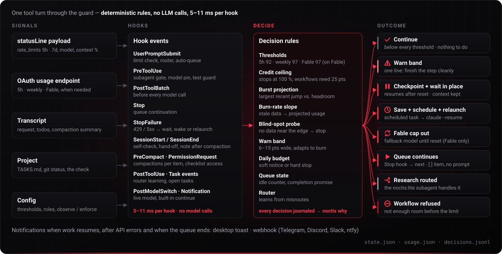
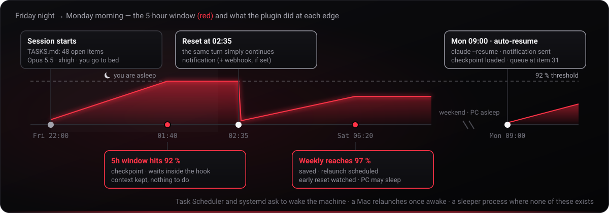
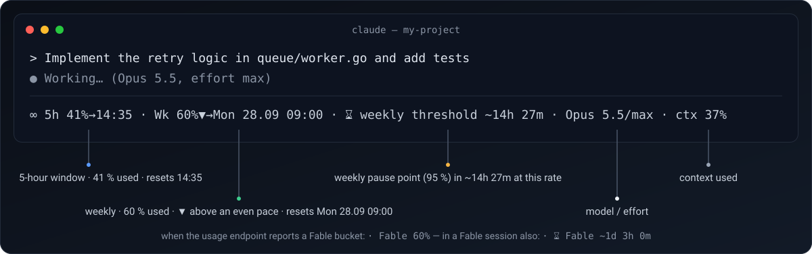
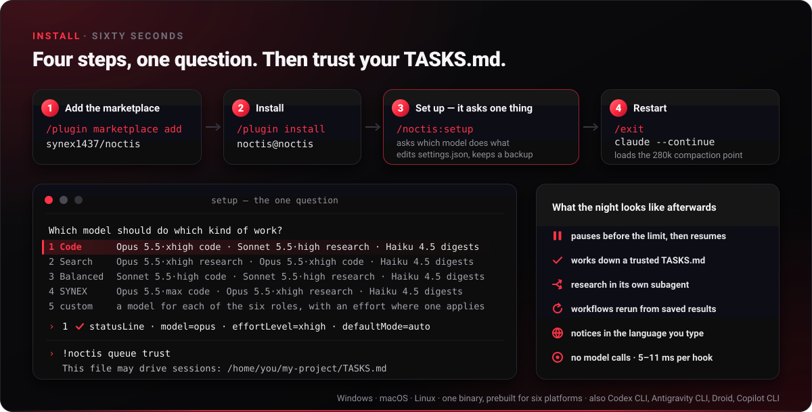
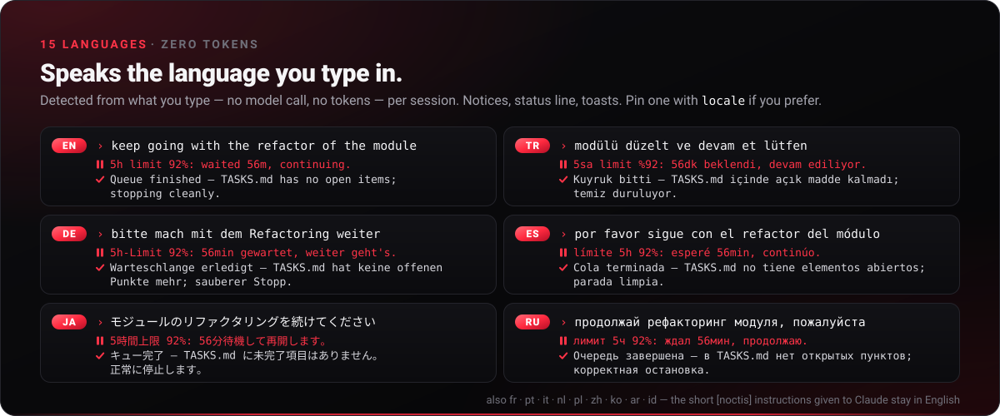

# Noctis guide

noctis has two jobs: to keep long Claude Code work going through the usage limits, and to keep Claude at its best while it does. The second means a small, clean context for each step, a check before a step counts as done, a stronger model for the step Claude gets stuck on, and limits spent on the work rather than on rereading a long conversation.

Everything the [README](../README.md) keeps short: what noctis changes on your machine and how to undo it, the queue format, what it does while you are away, running a large project on a server, lean compaction, the status line, the install details and the other AI coding tools it runs in. Every command, configuration key and file is in [REFERENCE.md](REFERENCE.md).

- [The first five minutes](#the-first-five-minutes)
- [What it changes on your machine — and how to undo it](#what-it-changes-on-your-machine--and-how-to-undo-it)
- [Queue file](#queue-file)
- [What it does while you're away](#what-it-does-while-youre-away)
- [Friday night → Monday morning](#friday-night--monday-morning)
- [Large projects on a server](#large-projects-on-a-server)
- [Lean compaction](#lean-compaction)
- [Status line](#status-line)
- [Install (details)](#install-details)
- [Other AI coding tools](#other-ai-coding-tools)
- [Works alongside other plugins](#works-alongside-other-plugins)
- [In your language](#in-your-language)
- [Reference and limits](#reference-and-limits)
- [Bug reports](#bug-reports)

## The first five minutes

1. After setup and the restart it asks for, look at the bottom of the window: `∞ 5h 41%→14:35 · Wk 23%▲→Mon 21.09 09:00 · Opus 5.5/xhigh · ctx 37%` — both usage windows and when each resets, the model and effort, and how far the context is on its way to where Claude Code compacts it. If it says *waiting for limit data*, send one message; it fills in after the first reply.
2. Type `/noctis:status`: usage, pause points, which model does which job, and the last decisions the plugin made.
3. Write the three-line `TASKS.md` below and type `/noctis:start TASKS.md`: noctis says how many jobs it found, and Claude works through them on its own, ticking each one off in noctis's copy of the list. `/noctis:stop` ends it early.
4. At a limit there is nothing to do. A reset within about 5½ hours is waited out inside the turn, context intact. For a later one, the work is saved and the same session is resumed with `claude --resume` in a new terminal — a Windows Terminal tab (or a console window), a macOS Terminal window, your Linux desktop terminal. On macOS and Linux it runs headless, with output in `resume-output.log`, when no terminal can be opened; on Windows a failed window launch is reported with the `claude --resume` command to run. Windows and Linux ask to wake the machine (Linux needs `CAP_WAKE_ALARM`); launchd cannot wake a Mac, so keep it from sleeping for the night.
5. Not ready to trust it? `"mode": "observe"` in `~/.claude/noctis/config.json` logs every limit, queue and routing decision and enforces none of them — not even the stop at 100 %, so turn off auto-reload in your Anthropic billing settings while you watch. Three things still happen in observe mode: the lite and digest subagents keep their write limits, a `model_not_found` error for the model `settings.json` selects still resets `model`, and `queue.github.closeOnDone` still closes issues.

## What it changes on your machine — and how to undo it

From the first session after install — before you run setup — noctis already points the status line at itself (a status line you had keeps running behind it; this edit makes no backup) and guards with the default thresholds. Setup then writes a backup `settings.json.bak-<time>` and touches exactly this:

| Where | What | Undo |
|---|---|---|
| `settings.json` → `statusLine` | Points it at the plugin's binary — that is how Claude Code reports your usage. A status line you already had keeps running behind it; only the command changes, so its other fields (`padding`, say) stay, and uninstall puts your command back. | `noctis install --uninstall` |
| `settings.json` → `permissions.defaultMode` | Set to `auto` (older Claude Code: `acceptEdits`) by the first setup on the account. **Claude will edit files and run commands without asking you first** — that is what lets it work while you sleep. A later setup run leaves the mode as it is — changed by you, or kept with `--permissions keep` — unless you pass `--permissions`. A relaunch after a pause runs in the mode the session ran in (`resume.permissionMode: inherit`); a `config.json` written by an earlier version keeps its `auto` there until you change it or run setup with `--permissions keep`. Never `bypassPermissions`: an unattended relaunch refuses that mode even if a config asks for it. | `--permissions keep` at setup; the `--permissions` value setup names as the way back; `noctis install --uninstall` |
| `settings.json` → `model`, and the effort in `modelSettings` or `env.CLAUDE_CODE_EFFORT_LEVEL` | Default model and effort = the *code* role of your profile (**Opus 5.5 · xhigh** with Code, the default). A level up to `xhigh` is saved for that model as `modelSettings.<model id>.effortLevel`, which Claude Code 2.1.251 or newer reads when a session starts, and setup takes away an `env.CLAUDE_CODE_EFFORT_LEVEL`, which would override it, keeping its value for uninstall. `max` (SYNEX) goes in `env.CLAUDE_CODE_EFFORT_LEVEL`, since no setting saves it, and so does any level on an older Claude Code or for a model setting that names no single model (`best`, `opusplan`, a provider's id); that variable overrides every other level, a typed `/effort` and the effort of noctis's own subagents too. A relaunch passes the level as `--effort` and sets the variable for `max` alone. A code role without an effort level, or on a model that has none (Haiku 4.5), sets none: a level setup wrote goes back to what you had before, one you set yourself stays, and a relaunch passes none. A Fable or Opus you picked yourself is kept; a model setup wrote earlier follows the profile. A setup run while Fable's cap has the default on a Fable or Opus fallback model keeps that model too and sets only the effort; unless your code role names that model, Fable's reset then puts in the model setup would have chosen without the switch: the code role's, or a Fable or Opus you picked yourself before it. | `--no-model` at setup keeps your model (the effort is still set); `noctis install --uninstall` |
| `settings.json` → `model`, `env.CLAUDE_CODE_EFFORT_LEVEL`, while it runs | Only if you run Fable: when its weekly cap runs out, both switch to the fallback role, and back after the reset. If Claude Code reports `model_not_found` for the model `settings.json` selects, `model` is set to the fallback model or removed; for another model the file stays as it is, and you are told to switch the session with `/model`. | — |
| `settings.json` → `env.CLAUDE_CODE_ENABLE_FUNCTION_HOOKS` | Set to `1` when it is missing, so Claude Code loads the [lean compaction](#lean-compaction) module. It is an early-access switch and loads the hooks module of **every** installed plugin, not only noctis's. A value you set yourself is kept. | `--no-lean` at setup (also turns lean compaction off); `noctis install --uninstall` |
| `settings.json` → `autoCompactWindow` | Set to `313000` when neither it nor `CLAUDE_CODE_AUTO_COMPACT_WINDOW` is set, so Claude Code compacts by about 280k tokens of context (`compaction.compactAt`) in a 1M window too, rather than near its end; a 200k window keeps Claude Code's own point ([Lean compaction](#lean-compaction)). Beside a percent — one you pick with `--compact-at 60%`, or a `CLAUDE_AUTOCOMPACT_PCT_OVERRIDE` of yours — it is `1000000` instead, so the percent holds for every model, of its whole window. Claude Code reads it as it starts, so it applies from Claude Code's next start. A value you set yourself is kept. An account set up before 8.6.0 gets it once, at the next session start, with a notice. | `--compact-at off` at setup; `noctis install --uninstall` |
| `settings.json` → `env.CLAUDE_AUTOCOMPACT_PCT_OVERRIDE` | Only when you pick a percent, as with `--compact-at 60%`: set to `60`, with `autoCompactWindow` `1000000` beside it, so Claude Code compacts at that share of each model's whole window, for every model — by about 588k tokens of context in a 1M window, 108k in a 200k one. A value you set yourself is kept. | `--compact-at off`, or a token count, at setup; `noctis install --uninstall` |
| `~/.claude/noctis/` | Its own `config.json`, state, usage snapshots, checkpoints, queues, logs | `noctis install --uninstall --purge`; without `--purge` uninstall keeps the folder and prints its path |
| A scheduled task, only while a resume is pending (and, with `alarm.digestAt` set, one for the daily digest) | Task Scheduler `Noctis-…` (can wake the PC), launchd `com.synex.noctis.…`, systemd `noctis-…` (each gets the PATH, time zone (`TZ`), display, certificate and proxy variables of the session that paused, so the relaunch finds `claude` as that session did; the proxy variables, which can hold a password, reach the runner through a file only you can read in `~/.claude/noctis/proxies/`, never through a command line or the plist, and a runner Task Scheduler starts gets all of these variables through that file) — or, where none of these exists, a background `noctis sleeper` process (it cannot wake the machine and does not survive a reboot). Next to a scheduled task, a background `noctis sleeper --watch` process checks for an early reset every 5 minutes until the resume time, and for the reset itself 10, 30 and 60 seconds after its time (`wait.earlyResetPollMinutes: 0` turns it off). | `noctis cancel`; `noctis install --uninstall` cancels every pending one and the digest's; `"alarm": {"wakePc": false}` stops the wake; clearing `alarm.digestAt` removes the digest's at the next session start or stop, or with `noctis digest` |
| Marketplace auto-update | Turn it on once in `/plugin` → Marketplaces → noctis → Enable auto-update, so new versions arrive on their own. Setup also tries to switch it on, which current Claude Code versions refuse; if setup says it could not enable auto-update, use that menu. Where setup did switch it on, it records that in `~/.claude/noctis/config.json`. | The same menu → Disable auto-update; `noctis install --uninstall` sets it back only where setup recorded switching it on, and leaves it alone once you switched it off yourself |

A `settings.json` that is a symlink — into a dotfiles repository, say — stays one: setup, uninstall and the model switch write the file it points to and keep that file's permissions. The same goes for noctis's own `config.json` and another tool's hook file. Every edit noctis makes to `settings.json` keeps the order of the keys already in it and its final newline; a key noctis adds goes last. Setup and uninstall write it under the same lock as noctis's other edits and change only the entries they set, so what another program saves there in the meantime stays; a file that stays locked or cannot be written is left as it was, and they say so.

After uninstalling, check `permissions.defaultMode`, `env.CLAUDE_CODE_EFFORT_LEVEL` and the `effortLevel` setup saved in `modelSettings` in `settings.json`: uninstall puts back the value you had before the first setup, however often setup ran since (a profile switch that changes the effort, say, or a setup while the fallback role stands in). A value you set yourself between two setup runs does not come back once a later run has replaced it. A value you changed after the last setup run stays, and so does one setup found already set to what it writes, or one it holds no record of. Uninstall then forgets what setup recorded, so a setup after it starts over as a first one: without `--permissions` it switches the permission mode to `auto` again, and it chains the status line you have then, which the next uninstall puts back. `env.CLAUDE_CODE_ENABLE_FUNCTION_HOOKS` is removed only when setup wrote it, and `autoCompactWindow` only while it holds the value setup or a session start wrote. An `env`, `permissions` or `modelSettings` block that setup added itself is removed too once it is empty, and so is a `modelSettings` entry left empty; a block you had before, even an empty one, stays.

**Network.** Two servers, plus any you configure. `api.anthropic.com`, the usage endpoint the Claude app itself uses, with the login token Claude Code already keeps — on macOS that lives in the Keychain, so expect an "allow access" prompt, one per account. The request says it comes from noctis (`User-Agent: noctis/<version>`). It is asked only when the status line is not enough: at most every 10 minutes when the status line has been quiet for 20 minutes, in a Fable session and when a subagent starts on Fable (every minute within 8 points of the Fable switch point), every 2 minutes down to every 15 seconds within 8 points of a pause point or of the 100 % stop (near the stop also while `/noctis:pause` runs), at most once a minute while the burn-rate projection of an older reading comes within 8 points of either, every 5 minutes while a paused session waits and 10, 30 and 60 seconds after the reset it waits for (`wait.earlyResetPollMinutes: 0` stops both), and once before a workflow launch, after an API error and before a relaunch. A hook does not wait for these requests: a detached process asks, and the answer is there for the next hook. It waits for the answer, at most 1.5 seconds, only when it has no reading from the last 20 minutes, within 8 points of a pause point or of the 100 % stop, and before a choice it makes once, such as a workflow launch; then it asks itself, and leaves the question to a detached process only when no answer came in those 1.5 seconds. And once a day the raw `plugin.json` on GitHub, to see whether a newer version exists — fetched by a detached process, so a session start never waits for it (`update.check: false` turns that off). Plus your webhook URL, if you set one, and GitHub through your own `gh` CLI when you use `noctis queue import` or `queue.github.closeOnDone`. No telemetry.

**It does not spend paid usage credits.** Work stops at 100 % of a window, or just before it when the last readings jumped far enough or a stale reading's trend says the next turns cross it, even if your thresholds are misconfigured or switched off, and even while `/noctis:pause` is running, because past that point the account pays for the overflow. A dynamic workflow fans out many agents at once and can burn the last points between two checks, so a new one is refused unless every usage window it can draw on has 25 points of room before its pause point (with the defaults: 5-hour at most 67 %, weekly at most 70 %). The Fable bucket counts when the usage endpoint reports one and Fable could run the workflow's agents: the session runs on Fable, a role the workflow advice names is on Fable, or the launched script names Fable, passes it in its args, starts another workflow or cannot be read (a workflow launched by name, for one). The one exception is observe mode, which does not enforce this stop either. `"credits": {"allowPaid": true}` if you *want* the overflow; `ceiling` and `fanOutHeadroom` tune the rest. What noctis cannot do is switch off auto-reload on the account — that is in your Anthropic billing settings. Nor can it hold back fast mode: `/fast` draws from usage credits at a higher rate from its first request and stays on in later sessions (it is saved as `fastMode` in `settings.json`), so `noctis doctor` warns while it is on.

**Queue mode works through a list of jobs for you.** Type `/noctis:start jobs.md` — any text or Markdown file, looked up in the project folder first — and noctis reads the jobs in it and says how many it found:

```text
☰ 5 job(s) detected in jobs.md — Claude works through them in order without stopping to ask (/noctis:stop ends it).
```

Checkbox, bullet and numbered items and `TODO:` lines are jobs, as in a [queue file](#queue-file); a file with none of them gives one job per line. noctis copies the jobs to a checklist of its own, and Claude ticks them there, so your file stays as you wrote it. Every time Claude stops, the Stop hook hands it the next open job and tells it not to stop or ask, until every job is ticked; a prompt you type in between does not end the queue, and it goes on after a compaction or a relaunch. `/noctis:stop` ends it and says how many jobs were done. noctis starts nothing, and says why, when the file cannot be read, holds no open job, is larger than 1 MB or holds more than 500 jobs, when noctis is paused, or when queues are off.

**A folder's `TASKS.md` drives nothing until you trust it.** A `TASKS.md` (or `tasks.md`, `.claude/TASKS.md`, `docs/TASKS.md`) may hold notes that were never meant as orders, and a checklist can arrive with a `git clone`, so noctis leaves such a file alone and does not bring it up: no instructions at session start, no continuation when Claude stops, no items in the checkpoint or the relaunch prompt, no issues closed. `/noctis:start TASKS.md` works through it once. To let it drive every session started in that folder, type `!noctis queue trust` in Claude Code (the `!` runs it as a shell command; `untrust` takes it back); `!noctis queue status` says where it stands:

```text
☰ TASKS.md in this folder holds 12 open item(s). It is not driving this session: a checklist can
  arrive with a repository, and driving means working through it without stopping to ask.
  To let it drive: noctis queue trust (noctis)
```

A trusted file drives the way a started list does: every time Claude stops, the Stop hook hands it the next open item. In Claude Code the project folder is the one the session started in, so the queue keeps driving after Claude moves into a subfolder with `cd`; a subfolder's own queue file counts only when the project folder has none you trusted. A queue file that is a link leading out of the folder, or that sits in a linked folder that does, is ignored, and `noctis queue import` writes through no such link. The trust covers every line the file held when you gave it. Ticking an item, or marking it done in a plain list, keeps it; a line added or changed later — an item, a ticked item reopened, a sub-bullet, a paragraph, a code block, a note Claude writes (a pull or a branch switch can bring them) — stops the file from driving until you trust it again, and noctis says how many items or lines are new (`status` lists them). Claude is told to change only the checkbox of an item it finishes and nothing else in the file. A trust given by noctis 7.1.0 or earlier recorded none of the lines, so it has to be given again. A trust unused for 30 days is dropped. It is meant to come from you: when Claude runs `noctis queue trust` in a Bash or PowerShell call, the PreToolUse hook refuses the call and tells you so, while the `!` command you type yourself runs without hooks. The hook reads the command line, not what finally runs, and reads it the way the shell would: it applies quoting, escapes, line continuations, brace expansion and globs, reads here-documents and drops comments, then finds the command by name or path, also in text the line hands to a shell or interpreter, `xargs`, `eval`, `source`, `env -S`, PowerShell's `Invoke-Expression` or `Start-Process`, or a command substitution ([details](REFERENCE.md#commands)). A name or command whose text exists only at run time, a script file that runs it, or another program that runs a command it is handed is not recognized: this stops Claude's direct call and is not a sandbox. Claude cannot set the trust behind your back another way either: the hook denies a file-tool write to noctis's own state or config file. A checklist noctis wrote, from `/noctis:start` or from your own prompt, needs no trust. Let every queue file drive without a trust, as versions before 5.4 did: `"queue": {"requireTrust": false}`. No queue at all: `"queue": {"enabled": false}`; no `TASKS.md` queues but keep `/noctis:start` and the checklists from long prompts: `"queue": {"files": []}`.

**The binaries.** The prebuilt binaries in `bin/` — one per CPU for Linux and Windows, and for macOS one universal binary that runs on Apple silicon and Intel Macs alike — are rebuilt from source by CI on every push, and the build fails unless they match the committed ones byte for byte. Release downloads carry GitHub build-provenance attestations (`gh attestation verify noctis-linux-amd64 --repo synex1437/noctis`). The Go code uses the standard library only; the binaries are not code-signed or notarized ([what that means](#install-details)).

**Turn it off.** For a while: `/noctis:pause 120` — for 120 minutes (60 by default) there are no limit pauses, no research routing and no queue continuation; the stop at 100 % still applies. Waits already set are kept: it lists the ones that will still resume on their own, each with the `noctis cancel --sid <id>` that cancels it. `/noctis:resume` ends it early. Watch only: `"mode": "observe"` in `~/.claude/noctis/config.json` (step 5 of [The first five minutes](#the-first-five-minutes)). Completely, inside Claude Code:

```
!noctis install --uninstall --host claude  # cancel pending resumes, restore settings.json — run this BEFORE
                                           # the next line, because removing the plugin deletes the binary that undoes it
/plugin uninstall noctis
```

The uninstall cancels every pending resume of the account with its scheduled task, as `noctis cancel` does, and says how many. It keeps `~/.claude/noctis/` (config, state, usage data, checkpoints, queues, logs) and prints its path: delete it yourself, or add `--purge` and the uninstall deletes that folder — only that one, not a folder that is a link, and nothing a link inside it leads to.

Clone install: in a terminal, `scripts/install.sh --uninstall` (macOS, Linux) or `scripts\install.ps1 -Uninstall` (Windows; `-Purge` for `--purge`) instead of the first line (it asks which tool; `--host claude` / `-Tool claude` skips the question). If the uninstall stops with "… cannot be read", nothing was removed: fix that file, or undo the settings by hand as the next paragraph describes, before you remove the plugin.

If the plugin is already gone and the settings remain, undo it by hand: remove `permissions.defaultMode`, `model`, `env.CLAUDE_CODE_EFFORT_LEVEL`, the `effortLevel` setup saved in `modelSettings`, `env.CLAUDE_CODE_ENABLE_FUNCTION_HOOKS`, `autoCompactWindow`, `env.CLAUDE_AUTOCOMPACT_PCT_OVERRIDE` and the `statusLine` block from `~/.claude/settings.json` (the status line noctis took the place of, the one you had before or one you set after installing, is saved as `statusline.chainCommand` in `~/.claude/noctis/config.json`), or restore a `settings.json.bak-<time>` copy — setup takes one before each run, so the oldest is closest to your original (it may already hold noctis's status line). `permissions.defaultMode` is the one that matters: left behind, every future session keeps editing files and running commands without asking.

## Queue file

One job per line, in a file you hand to `/noctis:start`, or in a `TASKS.md` you trust in the folder where you start `claude`:

```markdown
- [ ] add input validation to the signup form
- [ ] write tests for the payments module
- [ ] update README for the new CLI flags
```

That is the whole format. Claude takes the first open item, ticks it `- [x]` when done, and moves on without asking; once every item is ticked it stops, with `✔ Queue finished` if noctis had to push the list along (always for a checklist noctis wrote itself). Sloppy lists are accepted (`-[ ]`, `* [ ]`, `1. [ ]`, `[]`, `TODO:`), and an item wrapped over several lines is one item. Lines inside a fenced code block (```` ``` ```` or `~~~`) are examples, not items, and lines inside an HTML comment (`<!-- … -->`) are left out too, so commenting an item out switches it off. A file you hand to `/noctis:start` that holds no such item at all is read one job per line, leaving out blank lines, headings, rules, HTML comments, front matter, fenced code and lines that end in `:`; Claude ticks the jobs in noctis's copy, never in your file. In a checkbox list an item is done when its box is ticked (`[x]`, `[X]`, `[✓]`, `[✔]`). A plain bullet list without boxes works too: there `~~struck~~`, `(done)`, `✓` and `✔` mark an item finished, and Claude is asked to rewrite the list with checkboxes first.

Priorities and dependencies:

```markdown
- [ ] (P0) fix the login redirect #auth
- [ ] (P1) migrate users (after #auth, #db)
- [ ] deploy (after 2)
```

`(P0)`–`(P9)` orders the work (default P5, lower first) and `#name` tags an item. A tag is a letter of any alphabet, then letters, digits, `_` or `-` (`#payments`, `#ödeme`, `#café`), and letter case does not matter, Turkish's dotted and dotless i included: `(after #IŞIK)` waits for `#ışık`. `(after #tag)` or `(after 3)` waits until the referenced items are checked; `(after 2)` means the 2nd item in the file. `(after #12)` or `(after owner/repo#12)` waits for the items of that GitHub issue, and an item's reference to itself is ignored. The Stop hook hands Claude the highest-priority eligible item, says how many are still waiting, and stops cleanly when all are blocked or done. A reference that matches no tag, issue or item number is ignored, so a typo never deadlocks a night, and when it is written as one (`#tag`, `#12`, `owner/repo#12` or a number) it is named so you can fix it: `noctis queue status` and `noctis queue trust` list it, and the Stop hook names it once per session, to Claude and in a notice to you (five at most, then a count of the other new ones). Other words in the parentheses, as in `(after the release)`, are left alone.

Items only you can do — opening an account, a payment, a key, a review only a person can give — are marked `(human)` (or `(insan)`):

```markdown
- [ ] (human) open the payment provider account and put its key in .env #keys
- [ ] wire up the checkout (after #keys)
- [ ] write the pricing page
```

Claude skips such an item and never ticks it; in a turn noctis started it could not even if it tried, since the PreToolUse hook refuses the write. The items that wait for it stay blocked until you tick it, in the file or by telling Claude in a prompt that it is done. When only your items and the ones that wait for them are left, the session stops without calling the queue finished, and you hear once which items are yours.

An item that waits on something outside the session for a while — a DNS change, an answer, a quota — is set aside instead of stalling the night: `noctis queue defer "checkout" --reason "waiting for the API key" --until 2h` (`--until` is optional; `90m`, `3d` or a time work too). The file and its trust stay as they are: the item is not handed out, the items after it wait, and the reason is what you hear when the queue stops on it. Claude runs the same command when it meets such an item, and goes on with the next one. `noctis queue undefer "checkout"` (or `--all`) takes it up again. When a deferral with `--until` is all that holds the queue back, the session goes on by itself once it runs out: the Stop hook waits for it when it is near, and otherwise noctis resumes the stopped session then, as it does after a pause (`noctis status` shows when).

`noctis queue import` appends open GitHub issues as `- [ ] (P1) #123 Title` through the `gh` CLI (`owner/name#123` with `--repo owner/name`, or when the file lies outside the git checkout the issues are listed from) — priority from `P0`–`P9` or `priority: high` labels, idempotent. It adds nothing to a list without checkboxes, whose own items would then drop out of the queue: give them checkboxes first. It asks `gh` only for the issues you opened (the account `gh` is logged in with on the repository's host), or with `--author login1,login2` only for those authors' issues (`@me` names that account), up to `--limit` (200) per author, so a stranger's issue on a public repository never becomes a queue item; one that `gh` lists anyway is left out, and it says how many and whose. And `queue.github.closeOnDone` closes an issue once the items that start with its reference are all ticked; a `#123` further along an item closes nothing. A close that `gh` refuses (no login, no network) is tried again at the next stops, three times in all, and then left with gh's reason in `errors.log`.

A check between items is opt-in. Name the command in the queue file itself, on a line of its own:

```markdown
noctis-verify: `bash scripts/verify.sh quick`
```

or set `"queue": {"verifyCommand": "go test ./..."}` in `~/.claude/noctis/config.json`; the file's line wins. noctis runs the command in the project folder whenever an item was ticked, before Claude gets the next one and before the queue counts as finished; a failure sends Claude back to fix it with the end of the output, and after `queue.verifyAttempts` failures in a row (2) — with more attempts allowed, sooner when two failures in a row print the same output, since the fix in between changed nothing the check sees — the fix first goes once to a stronger model where there is one, one step up from the session's as for a [stuck item](#large-projects-on-a-server), and the next failure holds the queue until the command passes; the send-back before the hold tells Claude to undo and set aside an item it cannot fix now, so the rest goes on. It runs again at the first stop after you type a prompt, or at once with `noctis queue verify`, which lifts the hold when it passes. With `queue.github.closeOnDone`, an issue closes only once the command has passed with its items ticked. The command runs without a permission prompt, so it comes only from your own config file or from a queue file you trusted with that line in it, never from a checklist noctis wrote or a prompt: a changed `noctis-verify` line waits for your trust like any other line, and `queue.fileVerify: false` ignores these lines.

A full check can take minutes. Name a quicker one for between items on a line of its own, `` noctis-verify-each: `go test ./internal/queue/...` `` (or `queue.verifyEachCommand`), trusted like the other: it runs after each ticked item, and the full check runs once five ticked items wait for it (`queue.verifyFullEvery`) and always before the queue counts as finished; a failed check runs again in its own tier until it passes. And a check is not run again on a working tree it already passed on — the same `git status`, commit and file contents — but counts as passed; `queue.verifySkipUnchanged: false` runs it every time.

Without one, `noctis queue trust` and `noctis queue status` name the command your project seems to check itself with — `make check`, `npm test`, `go test ./...`, `cargo test`, `pytest` and the like, going by its build files — and the line to add; noctis never runs a command it only suggests. They also count the ticked items no check has passed, as `noctis status` and the daily digest do: work nothing checked is work you still have to check. A run cut short — past the time limit, or killed, as when the machine runs out of memory — says nothing about the code, so it runs once more before it counts as a failure.

A failing check is to be fixed in the code it checks. A run nobody watches can instead make it pass by weakening, skipping or deleting a test, or by loosening the linter or the CI configuration, and the failure stays. So while a queue drives the session, the first change Claude makes to an existing test or check file on an item that is not about tests is refused once, with a word on why; if the test is itself wrong, or the item needs the change, the same change made again goes through, and the daily digest lists the files changed that way. New tests Claude writes, items about tests, and turns you typed are left alone; `"queue": {"guardTests": false}` turns the guard off.

After a compaction the summary is all Claude has of the work before it, and a summary can drop or misstate what matters most to go on. So while a queue drives the session, the session start that follows a compaction adds a short note read from the queue file, git and the record of the check rather than from the summary: the item in hand, the files changed since the last commit, how the check stands, and, from the second compaction on the same item, how many it has gone through, with a word to hand long test runs, big diffs and wide searches to a subagent. It comes with or without [lean compaction](#lean-compaction).

`noctis queue status` shows where a queue stands — `☰ TASKS.md: 12 open item(s), 30 done`, the item that comes next, how many wait on others, your `(human)` items, the deferred ones and why, the last decisions Claude took on its own, the check between items, the ticked items no check has passed, and any hold — and `noctis queue status --json` gives the same to a script or a bot that watches the night.

## What it does while you're away

| Situation | What happens |
|---|---|
| Usage nears the limit (92 % / 95 %) | The turn pauses **before** the wall, after a checkpoint of the last request, touched files, `git status`, todos and next queue items. A reset within about 5½ hours is waited out in place; for a later one the work is saved and resumed by a scheduled task — Task Scheduler (can wake the PC), launchd or systemd. You get a desktop notification and, if set, a webhook when work resumes. When the pause comes from something other than the pause point — the daily budget, a burst or burn-rate projection, missing data, an imminent context compaction or the paid-credit ceiling — its notice says so: `Pause reason: burst projection.` A prompt you type is not held there: it goes ahead with a warning (`⚠ 5h window 93% (threshold 92%): your prompt goes ahead anyway.`), and the turn it starts, subagents included, runs to its end; only the 100 % stop, missing data or the daily budget's hard stop park it. Work that goes on by itself — the queue, a relaunch, a turn after yours — still pauses. |
| The reset comes early | The wait notices within minutes: it re-checks every 5 minutes and goes on as soon as the paused window reads at least 10 points below both its pause point and its level at the pause. `⚡ 5h limit reset ahead of schedule`. At the reset time itself it does not sit out the 90-second margin either: it reads the usage 10, 30 and 60 seconds after the reset and goes on at the first reading that shows it. After a limit error with no usage data at all, the scheduled relaunch waits for data: it checks after 10, 10, 20, 30 and 45 minutes, then gives up with a notification; an open session is woken in place after 10 minutes instead. If the Claude sign-in expires during the wait, usage cannot be read until Claude Code signs in again: you are told once, and the wait still ends at its planned time. |
| Claude stops with "moving on to the next thing" | In queue mode the Stop hook hands it the next unchecked item, no confirmations, and stops cleanly when the queue is empty. An empty `- [ ]` line is not an item: it is skipped and named once by its line number, and `noctis queue status` names it too. A new commit counts as progress, so an item that takes many turns is not given up while Claude commits along the way, and between commits a working tree that keeps changing earns a few more stops, while an edit undone again does not; when the queue stops making progress, noctis lets the session stop and stays out of it until an item is ticked, added or edited, or you type a prompt. |
| Only your items are left | Items marked `(human)` are skipped, and so are deferred ones. When nothing else is left, the session stops without calling the queue finished, and you hear once which items are yours and what the deferred ones wait on — a desktop notification too, and the webhook if one is set. Tick an item, tell Claude it is done or run `noctis queue undefer`, then type a prompt: the items that waited go on. A deferral with `--until` needs none of that: when it runs out, the session goes on by itself. |
| Claude would ask you something | While a queue drives the session, the question is not put to you, since nobody is there to answer it: Claude is told to decide, take the reading that fits the item and the project best and go on, and to note the decision for you (`noctis queue note`; for a checklist from your prompt, in its reply), which `noctis queue status` and the daily digest list. A question only you can settle — an account, a payment, a key — sets that item aside with its reason instead, and you hear it when the queue stops on it. A session no queue drives asks you as usual. |
| A session waits for your approval | When a session nobody watches — one a queue drives, or one noctis relaunched or woke — stops on a permission prompt or on a question from an MCP server, you get one notification, and the webhook if one is set, naming the folder, the session and what it waits for, at most once in 10 minutes per session. noctis approves nothing for you, and a session you run yourself gets no such notice. |
| A build or a test suite outlasts a tool call | Claude starts it with `noctis job run --label tests -- 'npm test'`: it runs apart from the session with its output in a log, so no time limit cuts it and no turn is spent polling it. When Claude has nothing else to do it ends its turn, and while a trusted queue drives the session the Stop hook waits for the job and hands Claude how it ended with the end of the log. `noctis job list` shows the jobs, `noctis job stop <id>` ends one. |
| A script calls `claude -p` in the project folder | Queues stay out of it: a run nobody watches (`claude -p`, the Agent SDK, a GitHub Action) is not handed `TASKS.md` or a checklist unless `queue.headless` is on, `NOCTIS_QUEUE=on` is set or you started the queue in it with `/noctis:start`, so a bot's one question gets its answer instead of the project's plan. `NOCTIS_QUEUE=off` keeps every queue out of any session. |
| You paste a long prompt with several tasks | noctis writes the checklist itself, in its own folder, and runs it: `☰ 5-step job detected`. When the jobs are written as sentences rather than as a list, Claude first copies them into that checklist in your own words, and noctis refuses any job whose words are not in your prompt, so nothing you did not ask for is queued. A prompt that tells Claude not to do the listed work yet — only to estimate, plan or review it — gets no checklist, while a rule on how to do it ("don't commit") keeps it. A turn Claude Code writes into the session itself — a subagent's report, a message from another session, a background task's notice — is not your prompt: it gets no checklist and leaves a running one alone. Listed lines noctis does not read as steps, and steps past the 40th, are named to you and kept at the end of the checklist file, where they do not drive the session. Claude Code would ask before Claude ticks a file there, so noctis answers that one request itself. Short prompts, questions and single tasks are left alone; `/noctis:stop` ends the job early, and `queue.auto: false` turns this off. |
| Fable's weekly cap runs out (only if you picked Fable) | The default model and effort switch to the fallback role. Mid-task, the session is checkpointed and relaunched on it in a new window, unless it has gone on in its own window by then; a new prompt is held with a note to switch with `/model` and resend. Subagents pinned to Fable, or asked to run on it, use the fallback model too, and a session that waited for another limit comes back on the fallback role (model and effort) when Fable's cap is still out. At the reset the model and effort go back to what `settings.json` had before, and are removed again if it had none; a model or effort you picked in the meantime, or a setup you ran, stays. |
| A prompt is research or writing | With the router on, it goes to the `noctis:lite` subagent — Sonnet 5.5 · high on Code (the default) and Balanced, Opus 5.5 · xhigh on Search and SYNEX — so the main session keeps its context for the code. The router is off until you turn it on: setup asks in a terminal, or pass `--router on`. The subagent may save only text documents, and never `CLAUDE.md`, the queue files, or anything under `.claude/`, the account folder (`CLAUDE_CONFIG_DIR`) or the plugin's own folder. File search (Explore) and the `noctis:digest` subagent for long test and build output run on Haiku 4.5. |
| A 429 kills the turn anyway | The session is woken **in place** at the reset if that is within about 5½ hours (`wake.maxMinutes`), with a scheduled relaunch as the net; a later reset gets the scheduled relaunch only. Claude Code's own error text is trusted over the percentages. In a `claude -p`, Agent SDK or GitHub Action run, where Claude Code ends the hook as it shuts down, the hook hands the error to a detached copy of noctis, which stores the retry and its relaunch. In a Claude Code on the web session (`CLAUDE_CODE_REMOTE=true`), where no status line reports usage and a relaunched `claude` would not be the session you watch, nothing is relaunched: the hook waits and wakes the session in place, for an unknown reset too, on the `wait.retryMinutes` steps for as long as `wake.maxMinutes` allows, and the first prompt is told once that limits cannot be tracked there. When a pause before the limit lasts longer than the hook may wait, the notice there says `work saved; resume it yourself after <time>`. Where noctis's commands are copied into the project's `.claude/skills` (or `~/.claude/skills`) as `noctis-pause`, `noctis-start` and so on, notices name `/noctis-pause` and the rest, and noctis takes those commands as it takes `/noctis:pause`. |
| The API is overloaded (529 / 5xx) | Growing pauses instead of dying: 30 s → 5 min, two-hour budget, one notice, one more if the outage is real. |
| A reply runs past the output token maximum | Once Claude Code's own retries are spent, noctis quietly tries once more 30 s later in the same session, telling Claude to go on in smaller steps and write a long file in parts. If the next reply runs past it too before a turn ends normally, noctis stops there with one notice and a checkpoint; raising `CLAUDE_CODE_MAX_OUTPUT_TOKENS` gives replies more room. |
| Claude Code cannot reach the API, or cannot load the AWS or Google Cloud credentials | Retried quietly on the `wait.retryMinutes` steps (10, 20, 30, 45, 60 minutes), with a notice only when noctis gives up on it. An account problem — billing, a hold, a sign-in, a verification, an organization that does not allow the login — is not retried: one notice says the account needs you. |
| Usage numbers stop arriving near the limit | It stops rather than guess: burn-rate projection, checked with the usage endpoint once it comes within 8 points of the pause point, burst prediction, a blind-spot probe, 15-second refreshes inside two points of the pause point or when one more jump like the last could cross it, and the same near the 100 % stop for a window whose threshold is switched off. When fresh data shows room again, the pause ends early. |
| A window is at 100 %, or about to cross it | Work stops there whatever the thresholds say, and just before it when the last readings jumped far enough or a stale reading's trend says the next turns cross it; a pause does not lift it (observe mode aside): past that point the account pays for the overflow. |
| The task is a fan-out ("migrate every endpoint") | With `workflow.suggest` on (it is off by default), you are told that it could run as a **dynamic workflow** if you ask for one with ultracode, with your roles profile's models, whenever a launch would be allowed right then; Claude is never told to start one. A new launch is refused in the warn band, or unless every window it can draw on (the Fable bucket only when Fable could run its agents) has 25 points of room before its pause point; every launch is recorded, and after a pause Claude is told to relaunch the same run so finished agents return saved results. In Claude Code, agents already running meet the pause point too: they are told to report what they have, then stopped, and the checkpoint names each agent cut short so the resumed session redoes its part. |
| You install at 99 % of the weekly quota | Setup works: `/noctis:setup`, `:status`, `:pause` and `:resume` pass the pause point (not the 100 % stop), and so does your answer to setup's question, like any prompt you type. The first session says the window is past its pause point, your prompts go ahead with a warning, work that goes on by itself waits for the reset (`/noctis:pause 120` lets it run), and `noctis check` reports it to scripts. |
| You write in German, Japanese, Turkish… | With `locale: auto` (the default), notices, the status line and a session's own toasts follow the language you type, detected without a model call; before that, the system language (`LC_ALL`, `LC_MESSAGES` or `LANG`, else English). `NOCTIS_LANG` or a fixed `locale` pins one language instead. Toasts from a scheduled relaunch use `NOCTIS_LANG`, `locale` or the system language. All fourteen are complete — CI fails if one lacks a message, takes different arguments from the English, or misaligns the `noctis status` labels. The `[noctis]` instructions handed to Claude stay English everywhere. |
| Files changed while the session waited | The checkpoint fingerprints the working tree: `git status`, the commit `HEAD` points at, and the size and modification time of up to 2000 paths: the files `git status` lists first, then the files inside a folder it lists as untracked. If any of it differs at resume — a file edited again after the session had already changed it, a commit, a pull — Claude is told that files it read or edited before the pause may have changed (`wait.workspaceGuard`). `checkpoint.gitSnapshot` can pin uncommitted changes to tracked files as a hidden git ref. Neither takes `.git/index.lock`, so a `git add` or `git commit` another session or agent runs at that moment is not turned away, and a `git status` or snapshot that noctis cuts off at its time limit leaves no `.git/index.lock` behind; a cut-off snapshot leaves no temporary index either. |
| Two things try to resume one session | Only one of them continues it. The relaunch, a wake in place and a `claude --resume` in another window claim the pause under a lock; a window still waiting on it stops instead of doing the work a second time. |
| A long wait ends | The session returns where you can see it — a Windows Terminal tab (or a console window), a new window of your tmux session when claude ran inside tmux, a macOS Terminal window, your Linux desktop terminal; `noctis doctor` says which. On macOS and Linux it runs headless with output in `resume-output.log` if none can be opened; on Windows a failed window launch is reported with the `claude --resume` command to run. A window noctis itself opened for that session earlier is closed first, unless it was used in the last five minutes (on macOS the session in it ends, and Terminal closes the window or keeps it as its profile's "When the shell exits" setting says); the window you started in stays open, shows `↪ continues in another window` and refuses new prompts while the relaunched session runs, during a `/noctis:pause` too. A relaunch that ends without the session answering — it exits with an error before any reply, or its window closes within 30 seconds without touching the session — keeps the wait and is tried again on the `wait.retryMinutes` steps; the fifth such relaunch gives up with a notification naming the project folder and the `claude --resume` command to run there. A relaunch that cannot start at all — the tool's command is not on `PATH`, or the project folder is gone — sends that one notification with the reason instead of first announcing the resume. |
| A terminal is closed, a process killed, a file half-written | The engine repairs itself: corrupt `state.json`/`usage.json` restored from backup, a dead hand-off unblocked, also when its process ID has passed to another program, a wait, or the wake of a queue stopped on a deferral, whose runner is gone (a reboot, a logout, a killed sleeper) re-armed at the next prompt, status-line refresh or session start, stray temp files and locks swept. |
| The context fills up | Claude Code compacts by about 280k tokens of context, in a 1M window too, and in the middle of a long turn such as a queue's as well (`autoCompactWindow`). Another point works the same: a token count or a percent of each model's window with `--compact-at`, a model's own window from `/autocompact`, or Claude Code's own point — noctis reckons with the one that decides ([Lean compaction](#lean-compaction)). With Claude Code's function hooks on, a turn that ends 90 % of the way to that point compacts right then; with its prompt caching off as well, the summary is written from a conversation with its old tool output trimmed. Without the function hooks the status line shows `ctx 92%▲` and the next prompt gets one notice to type `/compact`. When Claude Code ends a turn because its compactions cannot bring the context below its limit (`Autocompact is thrashing`, a prompt too long), the work goes on: 30 seconds later noctis starts a fresh session from the session's checkpoint, told to read large files and output in parts, rather than waking the session with the same full context. |
| A long job's context grows large | While a queue runs and the context holds 100k tokens or more, Claude is told to hand each next item, unless it is a quick edit, to noctis's `worker` agent, a fresh context that reads only what that item needs, to wait for its result and start no other item meanwhile, then to check its work and tick the item itself: the session no longer carries the whole conversation through every turn of the item. When noctis relaunches a session that paused for an hour or more with that much context, it starts a new session from the session's checkpoint instead of resuming it, since by then the prompt cache is cold and resuming would read the whole context again; the new session takes over the checklist and searches the old conversation when it needs a detail. It opens no extra window: a session that waits in its own window goes on there as before. `queue.subagentAboveTokens` and `resume.freshAfterMinutes` / `freshAboveTokens` set the limits, and `0` turns each off. |
| A threshold is edited into nonsense | The shipped default guards that window instead, and `noctis status`, `noctis doctor` and the next session all name the threshold. Set it to `0`, `null` or `false` to leave a window unguarded on purpose; it still stops at 100 %. |
| A new version is published | With marketplace auto-update on, Claude Code downloads it and the next session says `⬆ noctis <new> was downloaded (this session still runs <current>): run /reload-plugins` once. Otherwise a one-line notice names the version and the command. |

<p align="center"></p>

## Friday night → Monday morning

<p align="center"></p>

Nothing in that weekend needs you. The checkpoint holds the last request, touched files, `git status`, todos and the next queue items. A short reset is waited out inside the hook, so the turn simply continues; a long one is relaunched at the reset time — Windows, and Linux with `CAP_WAKE_ALARM`, can wake the machine for it, and a Mac relaunches once it is awake.

<p align="center"></p>

## Large projects on a server

noctis can carry a planned project of many phases through days of unattended work on a VPS or a dedicated server. What works best:

- **Run claude inside tmux.** `tmux new -s work`, then `claude` in the project folder. When a long wait ends, the relaunch opens as a new tmux window, so `tmux attach -t work` shows it from anywhere; on a machine with no desktop and no tmux it runs headless (`noctis doctor` says which).
- **Write the plan as a queue file.** One item per step, with priorities, `(after …)` dependencies, a tag per phase (`#phase2`) and a check line, `` noctis-verify: `bash scripts/verify.sh quick` ``. Trust it once you have read it: `noctis queue trust`. A line added or changed later — by a pull or a branch switch — waits for your trust again, and `noctis queue status` lists it.
- **Mark what only you can do.** Accounts, payments, keys and reviews get `(human)`: Claude does everything around them and, once nothing else is left, stops with the list of what is yours. Tick one, or tell Claude it is done, and the queue goes on.
- **Allow what the plan needs.** A permission prompt halts a session until someone answers it. Before you leave, allow the commands the plan runs in the project's `.claude/settings.json`; when a prompt still stops a session nobody watches, noctis tells you once, on your phone too with the webhook.
- **Give an item its model.** Tag a hard item `(opus)` and a simple one `(sonnet)` or `(haiku)`: a session on another model hands that item to noctis's `worker` agent on the tagged model, waits for its result and checks its work, so the strongest model goes where it matters and the easy items take less of the weekly limit. The session keeps its own model.
- **Read what Claude decided.** Claude decides without asking while the queue runs — a question it would put to you goes back to it — and notes each decision you may want to revisit (`noctis queue note`); `noctis queue status` and the daily digest list them, and each new session gets the last ones so it keeps to them.
- **Let a stuck item go up once.** When Claude keeps stopping on an item without progress, the continuation that would set it aside first hands it to a fresh subagent one step up — noctis's `worker` agent on Opus for a session on Sonnet or Haiku, its `deep` agent (Opus at max effort) for one on Opus below max — with a brief of what was tried and where it failed; Claude waits for its result, checks its work and ticks the item. The session keeps its own model, and so its prompt cache; only that item runs on the stronger model. If that model gets stuck too, the item is set aside as below, with the root cause it found as the reason, and the digest says so. SYNEX already runs at the top, so there nothing goes up. A check Claude cannot get to pass goes up the same way once before the queue is held. The queue file is not touched: noctis keeps the record. `queue.escalate` names the model or turns this off, `queue.maxEscalationsPerDay` (5) bounds it, and a pause that is due comes first.
- **Let Claude set aside what waits.** An item blocked on something outside the session is deferred with a reason (`noctis queue defer`), not stalled on; you hear the reason when the queue stops on it. An item Claude keeps stopping on without progress, or whose check it cannot fix, is set aside the same way before the queue would give up or be held, so one stuck item does not end the night. By default the continuation asks for that at the second stop in a row without progress, and the third ends the queue's continuations (`queue.maxIdleContinues`, 3); where a stronger model has its turn first, each comes one stop later. A stop while a subagent or a workflow Claude started still runs in the background is none of these: Claude Code wakes the session with its result, and the queue waits for it.
- **Run long commands as jobs.** Builds, full test suites and migrations go through `noctis job run`, so no tool call's time limit cuts them and no turn is spent polling.
- **Commit as you go.** A commit counts as progress, so a long item is not given up while it moves; a working tree that changes from stop to stop counts too, up to `queue.maxIdleContinues` stops between commits, but one that comes back to an earlier state does not; `queue.maxContinuesPerSession` (200) and `maxContinuesPerDay` (600) still bound a runaway loop.
- **Watch from outside.** `noctis queue status --json` (open, done, next, held, deferred, your items, pace) and `noctis why` feed a monitoring script or a chat bot, and `alarm.webhook.url` sends the notices to your phone. `noctis why --stats` sums up the decisions of the last 7 days: pauses by cause, resumes before the planned time, checks run, skipped and held, continues on a changed tree and items handed up or set aside (`--json` for a script).
- **Get a daily digest.** Set `"alarm": {"digestAt": "21:00"}` next to the webhook: every day at that time your phone gets one message with what each queue finished since the last digest, the item it takes next, how its check stands, what waits on you and on a deferral, the sessions waiting for a reset, and how much of the limits is used. A digest the machine slept through goes out when a session next starts or stops. `noctis digest` shows it now, `noctis digest --send` sends it now, and `noctis status` says when the next one goes out.
- **See whether the week covers it.** Once sessions have ticked three items, each within six hours of the one before, `noctis queue status` and the digest give the queue's pace: the time an item takes and its share of the weekly limit (so how many items a whole weekly limit covers), what the open items need of the weekly limit next to what is left before its pause point, and when they may be done — after the weekly reset when the week runs out first. It is the average of the last items, so it is rough for a queue whose items differ a lot in size.
- **Let the numbers pick the profile.** For each queue noctis also counts, per setup (the model and effort a session runs on), the items it finished, the ones that went up and the ones that got stuck, and what a whole weekly limit covers on it, the items that went up included: `Sonnet · high: 24 item(s) done; a whole weekly limit covers about 60 such items; 3 stuck item(s) went to a stronger model, 3 of them done there`. `noctis queue status` (`models` in `--json`), `noctis status` and the digest show it, and once the numbers say so they name the profile that finishes the queue for less: two setups with six measured items each whose limits differ by 15 % or more, eight items on Sonnet or Haiku of which a quarter went up, or eight on Opus of which none got stuck.
- **Size the items by what they took.** Each tick also notes what the item took — the context at the tick, the compactions and continues without progress on the way — and once three stops have found items ticked, `noctis queue status` sums it up (`models.ticks` in `--json`): `Last 12 item(s) ticked: context at the tick 61k tokens (median; most 140k), 3 compaction(s) and 2 continue(s) without progress on the way`. A median near the large-context hand-off (`queue.subagentAboveTokens`, 100k) or compactions on the way say the items are too large for one context: split them.
- **Keep scripts apart.** A cron job or a bot that calls `claude -p` in the same folder is not handed the project's queue, since runs nobody watches are left alone; set `NOCTIS_QUEUE=off` for a session that must never touch it, or `on` (or `queue.headless`) for one that should.

## Lean compaction

When Claude Code compacts a conversation — `/compact`, its own automatic compaction, or the early one below — noctis can trim what the summary is written from, so the summary request reads less. It trims only while Claude Code's prompt caching is off (`DISABLE_PROMPT_CACHING`): with caching on, the summary request reads the conversation from the prompt cache at a tenth of the input price or less (a twentieth on Opus 5.5), and a trimmed row would make everything after it cost the full input price or more, so noctis hands the conversation down as it is. It makes no model call of its own; the summary is still Claude Code's.

- **Trimmed, only in the older part of the conversation:** a tool result or tool input longer than 2 000 characters keeps its first and last 1 000 around a `[noctis: N chars trimmed]` marker; a `Read`, `Grep`, `Glob`, `LS`, `WebFetch` or `WebSearch` result is dropped when the same call, with the same arguments, ran again later and brought the content back (not an error, nor Claude Code's note that the file is unchanged since it was read); `<system-reminder>` blocks leave older user messages.
- **Never touched:** your prompts, Claude's replies, which tools ran with which arguments (apart from long strings in them), and the last 6 assistant messages with everything after them (`compaction.keepTurns`).
- **What the summary keeps:** each compaction gets a list of what to keep (`compaction.instructions`): your requests, the task or queue item in hand with what is done and what is left, each file changed and why, each command run with its exit status — one that timed out, was killed or failed marked UNVERIFIED, to be run again — the errors met and their fixes, the decisions and the approaches ruled out with the reason, open questions and the next step; file contents and tool output that can be read again stay out. A `/compact` with its own text keeps that text, and `""` sends none.
- **Not next to the 5-hour limit:** the early compaction below is not asked while the 5-hour window is within 6 points of its pause point, since the summary request could carry it past that point — the margin the guard keeps before Claude Code's own compaction (`compaction.contextPercent`); a later turn asks again. Near the weekly pause point it is asked as usual, since the guard does not pause there for a compaction either.
- **Early, between turns:** when a turn ends with the context 90 % of the way to where Claude Code compacts it (`compaction.earlyAtPercent`), noctis asks Claude Code to compact right then, between two turns, instead of a little later at its own point, which can fall in the middle of a long turn — once per crossing: it asks again only after a turn has ended below the mark. With the shipped point (below) that is at 252k tokens of context in a 1M window and about 150k in a 200k one; it moves with the point, wherever that is set. This works in an interactive session only; Claude Code 2.1.281 refuses it in `claude -p` and SDK sessions, where the trimming still applies to `/compact` and to Claude Code's automatic compaction. It stays off while Claude Code's own automatic compaction is off (`autoCompactEnabled: false`, `DISABLE_AUTO_COMPACT`, `DISABLE_COMPACT`).
- **Needs Claude Code's early-access function hooks:** `"env": {"CLAUDE_CODE_ENABLE_FUNCTION_HOOKS": "1"}` in `~/.claude/settings.json` (tested with Claude Code 2.1.281; 2.1.251 does not know the switch), which setup writes when it is missing and uninstall takes back. That switch loads the hooks module of every installed plugin, not only noctis's. `/noctis:setup --no-lean` turns lean compaction off (`compaction.lean: false`, which later setups keep) and takes the switch back if setup wrote it; a value you set yourself stays. Without the switch noctis works as before, and compaction is Claude Code's alone; once the context is 90 % of the way to where Claude Code compacts it in such a session, the status line shows `ctx 92%▲` and the next prompt gets one notice to type `/compact`. On a Claude Code older than 2.1.281 that notice names the version instead of setup, and `noctis doctor` flags that version when the last session ran on it without the module.

**Where Claude Code compacts.** On its own, Claude Code compacts when the context is 33k tokens short of its window, which in a 1M window is near 967k tokens: every request until then carries a context that large, and the model has that much more to sift. So setup writes `"autoCompactWindow": 313000` into `settings.json`, and Claude Code compacts by about 280k tokens of context (`compaction.compactAt`, 280000) in any larger window; a 200k window keeps Claude Code's own point, near 167k. This needs no function hooks, and since Claude Code checks it before each model request, a long turn compacts on the way as well, such as a queue going from item to item. `/noctis:setup --compact-at` moves the point:

| You pick | Setup writes in `settings.json` | Claude Code compacts by |
|---|---|---|
| nothing (`280k` is shipped) | `autoCompactWindow` 313000 | ~280k tokens in a 1M window, ~167k in a 200k one |
| a token count, from 67k to 967k: `--compact-at 600k` | `autoCompactWindow` 633000 | ~600k in a 1M window, ~167k in a 200k one |
| a percent of each model's window, from 10 to 100: `--compact-at 60%` | `env.CLAUDE_AUTOCOMPACT_PCT_OVERRIDE` 60, `autoCompactWindow` 1000000 | ~588k in a 1M window, ~108k in a 200k one |
| Claude Code's own point: `--compact-at off` | nothing, and takes back what setup wrote | ~967k in a 1M window, ~167k in a 200k one |

Claude Code reads where it compacts only as it starts, and again when `/autocompact` changes it, so what setup or a session start writes applies from Claude Code's next start: restart it after setup (`/exit`, then `claude --continue`), since `/reload-plugins` does not read it again. Until then the status line's `ctx`, the guard and, where lean compaction runs, the early compaction already follow the new point, as noctis reads `settings.json` as it is.

A value you set yourself — `autoCompactWindow`, `CLAUDE_CODE_AUTO_COMPACT_WINDOW`, `CLAUDE_AUTOCOMPACT_PCT_OVERRIDE`, or the window of one model that Claude Code's `/autocompact` saves in its `modelSettings` entry (`/autocompact 140k` has that model compact by ~107k, `/autocompact auto` gives it Claude Code's own point) — stays and decides. Beside a `CLAUDE_AUTOCOMPACT_PCT_OVERRIDE` of yours, set in `settings.json` or in your shell, setup and the session start write `autoCompactWindow` `1000000` in place of the 313000 for a token count, which would narrow the window the percent is taken of (in a 1M window 60 % would come to about 176k, 60 % of 313000, rather than 588k). Claude Code compacts at a percent only for a model it has a window for: by itself it keeps none for some models — Haiku 4.5, the other Claude 4 models and older ones, a Bedrock inference profile — and compacts those only once the context is full; the `1000000` beside the percent gives every model its whole window. On an account set up before 8.6.0, the next session start writes the setting once and says so; take it out and it stays out. A `compaction.compactAt` you edit in `config.json` reaches `settings.json` at the next session start the same way. noctis reckons the point as Claude Code does, for each session from its model and window, whichever of these decides it: the status line's `ctx`, the early compaction above and the limit guard follow it, and `noctis status` and `noctis doctor` say where Claude Code compacts and which setting decides it. A model's own window counts under every name Claude Code gives the model — its alias, a dated or `[1m]` id, a provider's id such as Bedrock's with its region prefix — as Claude Code works the name out from the settings and the environment. noctis lays the settings files over each other as Claude Code does — the account's `settings.json`, the project's `.claude/settings.json` and `.claude/settings.local.json`, then the managed settings — so a point set in any of them reaches the status line, the guard and the early compaction alike, and `noctis status` and `noctis doctor` name the file it comes from; setup writes only the account's `settings.json`. Like Claude Code, noctis reads a project's `.claude/settings.local.json` at the root of the git work tree the session is in (of a linked work tree, at the main work tree), laid over the one in the session's directory, where that root, its `.git` and its `.claude` are yours and it is not your home directory; on Windows it reads only the session directory's. Near the 5-hour pause point, the guard pauses at 95 % of that point (266k tokens with the shipped one), so the summary request does not run into the limit. Once Claude Code has compacted a session, noctis forgets the context fill it had until the status line reports the new one, so nothing weighs the context from before the compaction.

**When the context stays full.** A file or a command output too large for the window can fill the context again right after each compaction; Claude Code then ends the turn (`Autocompact is thrashing`, the API finds the prompt too long, or the model reaches its context window limit). Woken in place, the session would send the same full context again, so noctis starts a fresh session from its checkpoint 30 seconds later, with the same checklist, told to read large files and output in parts; a full context is no limit, so this needs no usage data. If that context fills up as well, the next fresh start waits `wait.retryMinutes` (10, 20, 30, 45 minutes); after five fresh starts that fill up again, it stops, sends a notification and leaves the checkpoint for the session you start next. A turn that ends normally starts the count again, also while noctis is off. A Claude Code on the web session cannot be started afresh: there the notice says to run `/clear`, or `/compact` once what filled the context is gone, and the session `/clear` starts goes on from the checkpoint.

Each compaction noctis trimmed adds a line to `~/.claude/noctis/compact.log`; `noctis status` counts them and `noctis why` lists them among its decisions. To turn it off: `"compaction": {"lean": false}` in `~/.claude/noctis/config.json`; the other keys are in [REFERENCE.md](REFERENCE.md). A key of the wrong type or out of range falls back to its shipped value, and `noctis status` and `noctis doctor` name it.

## Status line

<p align="center"></p>

```
∞ 5h 41%→14:35 · Wk 60%▼→Mon 28.09 09:00 · ⌛ weekly threshold ~14h 27m · Opus 5.5/xhigh · ctx 37%
```

`41%→14:35` is the share of the window used and when it resets; a reset on another day also shows the day and date. `▲ / ● / ▼` shows whether weekly use is below, on or above an even pace toward the weekly pause point — `▼` means that at this rate you reach it before the reset. `⌛` says when a pause point will be reached at the current rate, if that comes before the reset. When the usage endpoint reports a Fable bucket, the line shows it (`· Fable 60%`), and a Fable session gets its own ETA (`· ⌛ Fable ~1d 3h 0m`). A `⚠` in front of a window means it is within 6 points of its pause point, `⏸ 02:36` shows a pending resume time, `↪ continues in another window` marks a window whose session was relaunched elsewhere, `⚠ hooks inactive` means the status line updates but no hook has run for 30 minutes, `ctx 37%` is how far the context is on its way to where Claude Code compacts it (100 % is the compaction point, not the end of the window; the share of the window while Claude Code reports no token count), `ctx 92%▲` means it has passed `compaction.earlyAtPercent` in a session where [lean compaction](#lean-compaction) is not running (type `/compact`), and `👁` means observe mode. None of it spends a token. `statusline.mode: silent` keeps the data capture but prints nothing, or only your chained status line.

## Install (details)

<p align="center"></p>

**From a marketplace** — the lines in the [README](../README.md#install). `setup` asks one thing, **which model should do which kind of work**, and remembers it as your *roles profile*:

| Profile | code | research & writing | planning | digests & search | fallback |
|---|---|---|---|---|---|
| **Code** — the default, for writing code | Opus 5.5 · xhigh | Sonnet 5.5 · high | Opus 5.5 | Haiku 4.5 | Opus 5.5 · xhigh |
| **Search** — for research and writing | Opus 5.5 · xhigh | Opus 5.5 · xhigh | Opus 5.5 | Haiku 4.5 | Opus 5.5 · xhigh |
| **Balanced** — spends less of your limits | Sonnet 5.5 · high | Sonnet 5.5 · high | Opus 5.5 | Haiku 4.5 | Sonnet 5.5 · high |
| **SYNEX** — the only profile at max | Opus 5.5 · max | Opus 5.5 · xhigh | Opus 5.5 | Haiku 4.5 | Opus 5.5 · max |
| **custom** | a model per role, with an effort where one applies | | | | |

Run `/noctis:setup` again to change it, or skip the question with `--profile code|search|balanced|synex` (in any case; `noctis`, SYNEX's earlier name, still works) or `--code opus:high --research sonnet:high …`; `/noctis:status` shows the current assignment. Why these: on the three coding benchmarks Anthropic published with Opus 5.5, at max it beats Fable 5.1 at max and costs less per task (Terminal-Bench 4.0 64.8 vs 55.8, FrontierCode 54.4 vs 50.3, CursorBench 57.8 vs 51.8), which is where SYNEX codes; at xhigh it out-researches Fable 5.1 and Opus 5 at max (WANDR 71.3 vs 68.7 and 67.2), which is where Search researches. Sonnet 5.5 costs half as much per token ($2 / $10 per million input / output tokens against $4 / $20) and comes close to Opus 5.5 at max (SWE-Bench Pro 81.3 vs 89.9, CursorBench 55.5 vs 57.8, GDPval-AA 1844 vs 1846; ahead on Terminal-Bench 4.0, 70.6 vs 64.8), but Anthropic says it saves the most at lower effort and costs about as much as Opus at the highest settings, where it may also start review rounds of its own, sometimes with subagents. So every role at xhigh or max stays on Opus, and Sonnet takes Code's research and Balanced's code and research at high — not lower, since at low and medium it may stop a long task to check in (CursorBench 47.8 at high, 39.2 at medium): planning with Opus and executing with Sonnet is Anthropic's own pairing for everyday work. Research at low effort collapses (WANDR 31.2), so no profile researches at low. Fallback is the code model. Code is the default since 8.3.0, and xhigh the highest level a profile saves: on Opus 5.5's system card max scores no better than xhigh on two of the three coding benchmarks (Terminal-Bench 4.0 64.8 at max against 66.4 at xhigh, within the error bars; FrontierCode 54.4 at max against 54.6 at medium), and Claude Code's effort table warns that max may show diminishing returns and is prone to overthinking. SYNEX stays for those who measure a gain from it. noctis watches one per-model weekly cap, Fable's: if you move up to Fable yourself, it switches you to the fallback model when that cap runs out and returns you to Fable once it resets. Sonnet 5.5 needs Claude Code 2.1.284 or newer: an older one gives an earlier Sonnet for `sonnet`, and when a role runs on it, `noctis doctor`, `/noctis:status` and setup name the version the last session ran.

Effort reaches the main session, the research subagent and — if you give the digest role a model with effort levels — the digest subagent. `Plan` and `Explore` take a model only, because the Agent tool has no effort to give them, and Haiku 4.5 has no effort levels at all; setup says so instead of pretending otherwise.

Setup makes six edits to `settings.json` — status line, permission mode, default model, effort level, the function hooks switch lean compaction needs and the compaction point (`autoCompactWindow`, with `CLAUDE_AUTOCOMPACT_PCT_OVERRIDE` for a percent) — listed with their undo in [What it changes on your machine](#what-it-changes-on-your-machine--and-how-to-undo-it). Flags: `--permissions keep`, `--no-model` (keeps your model; the effort level is still set), `--no-lean` (no function hooks switch, lean compaction off), `--compact-at 280k|60%|off` (where Claude Code compacts: a token count from 67k to 967k, a percent of each model's window, or `off`, which leaves it to Claude Code), `--config-dir <dir>` for another account (repeat it for several), `--router on|off` (research routing; without it setup asks in a terminal, and elsewhere leaves it as it is), `--preset conservative|balanced|aggressive` (pause at 85/82/90, 92/95/97 or 96/97/98 %). Every flag: [REFERENCE.md](REFERENCE.md#commands).

**From a clone or the GitHub ZIP** (Code → Download ZIP), a per-account copy lands under `~/.claude/skills/`: run `.\scripts\install.ps1` in PowerShell on Windows or `./scripts/install.sh` on macOS and Linux — both first ask which AI coding tool this is for — then restart Claude Code (`/exit`, then `claude --continue`), which reads where it compacts only as it starts. That copy is 21 files (22 on Windows) and 7–8 MB, about twice that on macOS, whose one binary holds the builds for both CPUs; almost all of it is your platform's binary. Nothing is downloaded or compiled; the binary is already in the repo (`bin/darwin/` on macOS, `bin/<os>-<arch>/` elsewhere), and one that does not match `bin/SHA256SUMS` is refused rather than installed. In this copy the hooks call the binary directly, never through a shell, and Git Bash is not needed on Windows (run from Git Bash, `install.sh` stops and points to `install.ps1`).

**If nothing happens at all** — no status line, no notices, and `noctis doctor` will not run either — the binary is not being allowed to execute. The binaries are not code-signed or notarized, so:

- **macOS**: a browser download gets a quarantine flag and is killed on sight. `xattr -dr com.apple.quarantine <plugin folder>`, or install with `git clone`, which never sets the flag.
- **Windows**: SmartScreen may block a downloaded `.exe` — Properties → Unblock, or clone instead.
- **From a zip**: zips do not always carry the executable bit. `chmod +x bin/noctis bin/*/noctis`.
- **Anything else**: run `bin/<os>-<arch>/noctis version` (`bin/darwin/noctis version` on macOS) in a terminal — the error it prints is the real one. Outside Claude Code, use the full path setup prints, or add that folder to your PATH. To build from source, follow [CONTRIBUTING.md](../CONTRIBUTING.md).

In the VS Code and Cursor extensions everything works, except that a relaunch after a long wait happens outside the editor — in a terminal tab or window, or, on macOS and Linux, headless when none can be opened — never in an editor tab.

## Other AI coding tools

The same engine also runs inside **OpenAI Codex CLI**, **Antigravity CLI** (Google), **Factory Droid** and **GitHub Copilot CLI**, with fewer features: Codex and Antigravity pause before the limit, checkpoint, wait and relaunch (Antigravity also retries after a quota error); Copilot gets queue mode plus a checkpoint and retry after a rate-limit error; Droid gets queue mode only. None of them gets model fallback, research routing or same-session wake. From a clone or the GitHub ZIP (Code → Download ZIP), `./scripts/install.sh` (macOS, Linux) or `.\scripts\install.ps1` (Windows) asks which tool — or pass `--host codex` / `-Tool codex` — then wires that tool's hook file and resumes with its own command. These adapters are tested against stand-ins of the tools, and the Claude Code, Codex and Copilot command-line flags are checked against the real CLIs every week; none has run a full real session yet. Details: [REFERENCE.md](REFERENCE.md#other-ai-coding-tools) and [HOSTS.md](HOSTS.md).

## Works alongside other plugins

In Claude Code, noctis adds hooks and a status line and never removes or rewrites anyone else's (on Antigravity CLI it replaces a custom status line). Claude Code runs every hook for an event, so a loop plugin and noctis's queue can both push the same turn — harmless, but if you see double continues, pause one. A status line you already had (ccstatusline, claude-powerline) keeps running behind noctis's, and usage dashboards (ccusage, Claude-Code-Usage-Monitor) read the same files and are unaffected. Another tool that resumes sessions after a limit (unsnooze, claude-auto-resume) would race noctis — use one of them. `noctis doctor` lists the neighbours it can see.

## In your language

<p align="center"></p>

## Reference and limits

Every command and flag, the full configuration table, the host adapters and the file layout are in [REFERENCE.md](REFERENCE.md). What each test suite asks, what CI runs and what the latest run measured: [TESTING.md](TESTING.md). Design notes and the bug log (Turkish): [PLAN.md](PLAN.md). Release history: [GitHub Releases](https://github.com/synex1437/noctis/releases).

Three limits worth knowing. Usage data comes from Claude Code's status-line payload (`rate_limits`, Claude Code ≥ 2.1.251) and from the undocumented OAuth usage endpoint, which supplies Fable's bucket and backs up the 5-hour and weekly windows when the status line goes quiet — so watch `errors.log` after Claude Code updates. Same-session wake relies on `asyncRewake`, documented as observational, with the scheduled relaunch as the fallback. And lean compaction runs on Claude Code's early-access function hooks, which may change between releases; without them, compaction is Claude Code's alone.

## Bug reports

Bug reports with `noctis doctor` output and the relevant `errors.log` / `noctis why --last 20` lines are the most useful thing you can send; `noctis report --bundle` zips all of that (tokens, webhook URLs, passwords in URLs and `queue.verifyCommand` are redacted, your home folder shows as `~`, and prompts parked until a reset, the subjects of open tasks, what recent workflows were launched with and the permission rules in `settings.json` are left out, only their length kept; file paths and whatever the logs hold are not, so read it before you attach it). Build and test loop: [CONTRIBUTING.md](../CONTRIBUTING.md).
